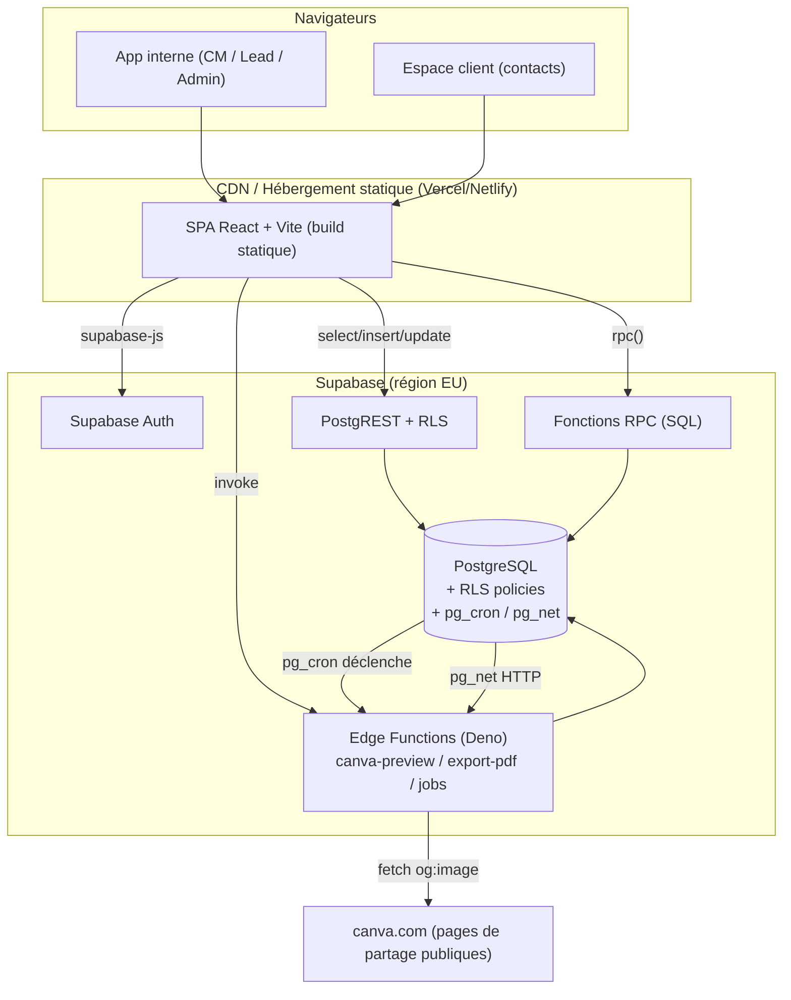
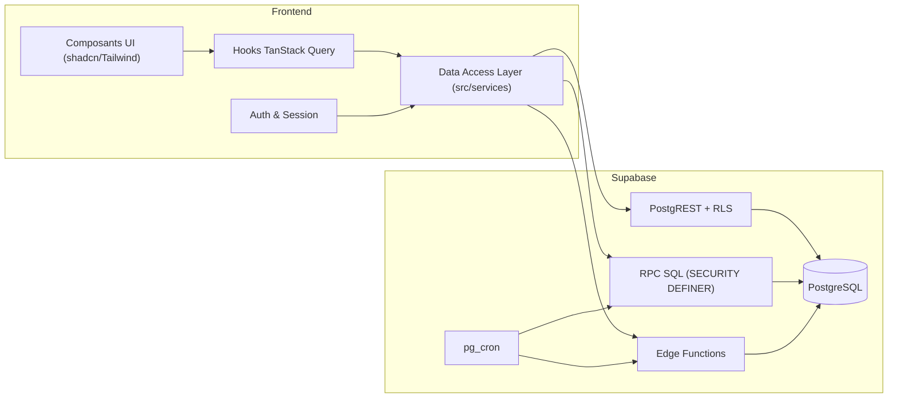
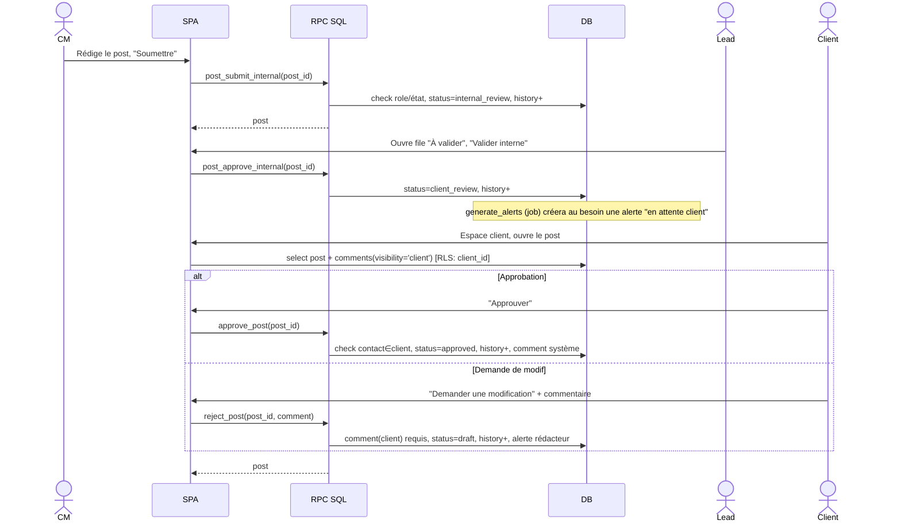
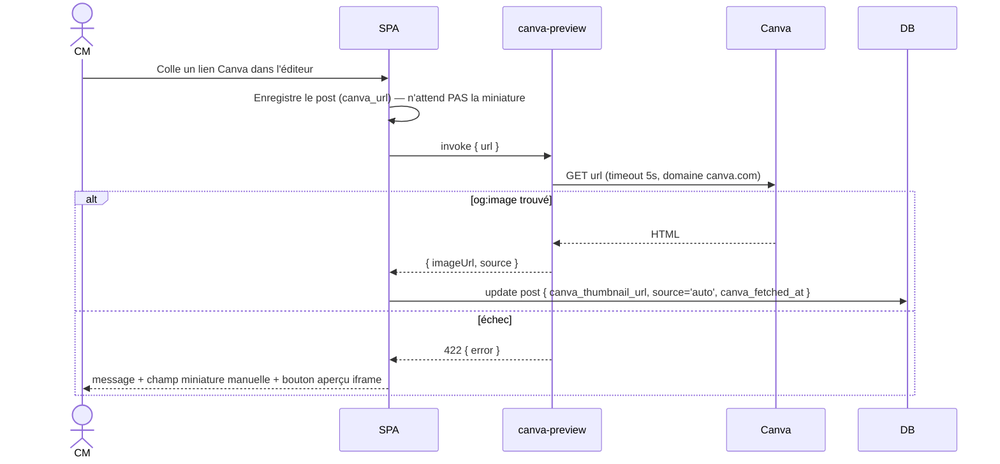
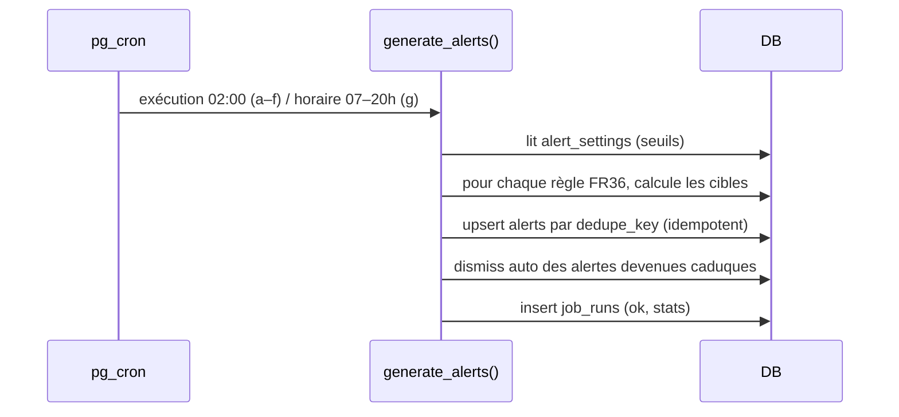
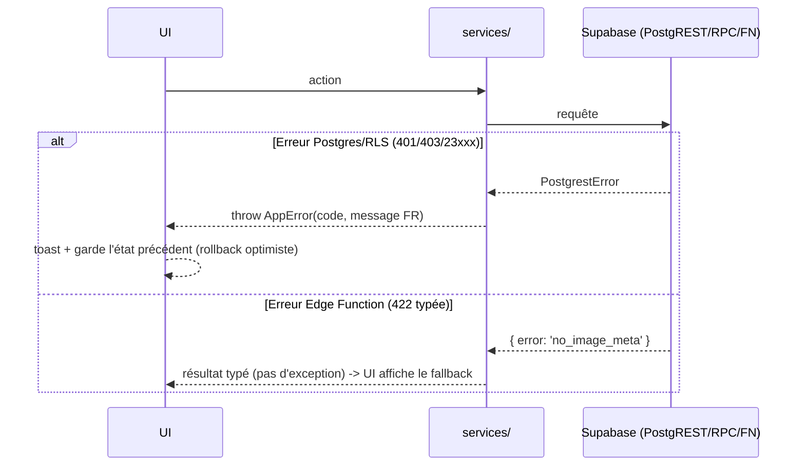

# Outil métier Community Management — Fullstack Architecture Document

## Introduction

Ce document décrit l'architecture fullstack complète de l'outil métier Community Management :
frontend, backend (Supabase / PostgreSQL), leur intégration, et les règles d'isolation
multi-clients. Il est la source de vérité unique pour le développement piloté par agents IA.

### Starter Template or Existing Project

N/A — projet greenfield. Pas de starter imposé. L'application est bootstrappée manuellement
avec Vite (`react-ts`) puis Tailwind + shadcn/ui, et le dossier `supabase/` est initialisé
avec la CLI Supabase. Contraintes issues du PRD : SPA React hébergée (pas de logiciel à
installer), backend Supabase, aucune API tierce payante, notifications in-app uniquement en
v1.

### Change Log

| Date | Version | Description | Author |
|---|---|---|---|
| 2026-08-30 | v1.0 | Architecture initiale dérivée de `docs/prd.md` | Architect (BMad) |

## High Level Architecture

### Technical Summary

Application web **SPA React + TypeScript (Vite)** servie en statique par un CDN (Vercel ou
Netlify), s'appuyant entièrement sur **Supabase** comme backend : PostgreSQL avec **Row
Level Security** pour 100 % de l'autorisation (isolation stricte entre clients et par rôle
interne), Supabase Auth pour l'authentification, et **Edge Functions (Deno)** pour la
logique non exprimable en SQL/RLS : récupération de la miniature Canva, génération d'export
PDF, et jobs planifiés. L'ordonnancement est assuré par `pg_cron` + `pg_net`. Le frontend
parle directement à Postgres via le client `supabase-js` (PostgREST) et via `rpc()` pour les
opérations métier sensibles (transitions de statut, approbation client). Cette architecture
BaaS/serverless élimine tout serveur applicatif à opérer, tient dans les paliers gratuits à
l'échelle visée (≤ 50 clients, ≤ 20 utilisateurs internes, ~10 000 posts / 2 ans) et
centralise la sécurité au plus près des données, ce qui est le principal risque du produit.

### Platform and Infrastructure Choice

**Platform:** Supabase (backend) + Vercel ou Netlify (hébergement frontend statique)
**Key Services:** Supabase PostgreSQL, Supabase Auth, Supabase Edge Functions, `pg_cron`,
`pg_net`, PostgREST ; hébergement statique + previews par PR ; GitHub Actions (CI).
**Deployment Host and Regions:** Supabase région EU (Frankfurt `eu-central-1`) pour
proximité et RGPD ; CDN edge global pour l'app statique.

Alternatives écartées :

- **Next.js + route handlers + Vercel** : ajoute une couche serveur (SSR, API routes) non
  nécessaire pour un outil interne, et disperserait l'autorisation entre middleware et DB.
  On préfère toute la sécurité en RLS.
- **Node/Express + Postgres managé** : serveur à opérer, plus de code d'autorisation à
  écrire et tester, pas de gain à cette échelle.

### Repository Structure

**Structure:** Monorepo léger, mono-package (un seul dépôt, un seul `package.json`
applicatif).
**Monorepo Tool:** aucun (pas de Nx/Turborepo). Les Edge Functions ont leurs propres imports
Deno et ne partagent pas le `node_modules` du front.
**Package Organization:** `src/` pour l'app React ; `src/shared/` pour les types et schémas
Zod réutilisés par le front et (par copie/vendor) par les fonctions ; `supabase/migrations/`
pour le schéma SQL ; `supabase/functions/` pour les Edge Functions ; `docs/` pour PRD /
archi / standards.

### High Level Architecture Diagram



### Architectural Patterns

- **BaaS / Serverless :** tout le backend est Supabase (Postgres + Auth + Edge Functions), zéro serveur applicatif maison — _Rationale :_ échelle petite, sécurité centralisée en DB, coût et exploitation minimaux.
- **Security-in-the-database (RLS-first) :** l'autorisation vit dans les policies PostgreSQL, jamais seulement dans l'UI ; le front est « non fiable » — _Rationale :_ l'isolation client est l'exigence n°1 (NFR2/NFR3) ; une seule couche à auditer.
- **RPC pour les transitions métier sensibles :** changements de statut, `approve_post`, `reject_post`, actions en masse passent par des fonctions SQL `SECURITY DEFINER` validant rôle + état — _Rationale :_ éviter des règles de transition dupliquées/contournables côté client.
- **Component-based UI + TypeScript strict :** composants React réutilisables, primitives shadcn/ui (Radix) accessibles — _Rationale :_ maintenabilité, accessibilité AA, cohérence.
- **Server-state via TanStack Query :** le cache de données serveur est TanStack Query au-dessus de `supabase-js` ; pas de store global lourd — _Rationale :_ invalidations simples, optimistic updates pour le drag & drop calendrier.
- **Schémas Zod partagés :** un schéma par entité sert à la fois la validation de formulaire (react-hook-form) et les guards runtime — _Rationale :_ une seule définition de forme de données.
- **Deux applications, un build :** app interne (`/app/*`) et espace client (`/portail/*`) dans le même bundle, séparées par le routeur et surtout par RLS — _Rationale :_ éviter un second projet ; l'isolation réelle est en DB, pas dans le routage.
- **Jobs idempotents planifiés :** `generate_alerts`, `purge_trash` re-exécutables sans effet de bord (clé de déduplication) — _Rationale :_ NFR7, robustesse aux relances de cron.

## Tech Stack

### Technology Stack Table

| Category | Technology | Version | Purpose | Rationale |
|---|---|---|---|---|
| Frontend Language | TypeScript | 5.5.x | Langage unique front + fonctions | Typage strict, partage de types |
| Frontend Framework | React | 18.3.x | UI SPA | Stack habituelle de l'équipe |
| Build Tool / Bundler | Vite | 5.4.x | Dev server + build statique | Rapide, simple, pas de SSR |
| UI Component Library | shadcn/ui (Radix UI) | radix `1.x` | Primitives accessibles (dialog, popover, menu…) | WCAG AA, personnalisable, pas de lock-in |
| CSS Framework | Tailwind CSS | 3.4.x | Styles utilitaires | Cohérence, vitesse, mémoire projet (écrans larges) |
| State Management | TanStack Query | 5.x | Cache d'état serveur | Invalidations, optimistic updates |
| Local UI State | Zustand | 4.x | État UI transverse ponctuel (filtres, sélection) | Léger, optionnel |
| Forms | react-hook-form | 7.x | Gestion de formulaires | Perf, peu de re-renders |
| Validation | Zod | 3.23.x | Schémas partagés form + runtime | Source unique de forme |
| Routing | React Router | 6.26.x | Routage `/app` et `/portail` | Standard SPA |
| Calendar | FullCalendar (`@fullcalendar/react`) | 6.1.x | Vues mois / semaine | Mûr, drag & drop, i18n FR |
| Drag & Drop (kanban/liste) | dnd-kit | 6.x | Kanban et réordonnancements | Accessible, moderne |
| Dates | date-fns + date-fns-tz | 3.x | Manipulation + fuseau Europe/Paris | Léger, explicite sur TZ |
| Charts | — | — | Aucun en v1 | Pas d'analytics |
| Backend Platform | Supabase | plateforme | Postgres + Auth + Edge Functions | BaaS, RLS, EU |
| Database | PostgreSQL (Supabase) | 15.x | Données + autorisation (RLS) | Fiabilité, RLS, SQL riche |
| API Style | PostgREST (REST auto) + RPC SQL | via supabase-js 2.45.x | CRUD + opérations métier | Pas d'API à écrire ; RPC pour la logique sensible |
| Auth | Supabase Auth (GoTrue) | plateforme | Email/mot de passe, sessions JWT | Intégré, hash géré |
| Serverless Functions | Supabase Edge Functions (Deno) | Deno 1.4x runtime | canva-preview, export-pdf, orchestration jobs | Pas de serveur, proche DB |
| Scheduler | pg_cron + pg_net | extensions PG | Déclenchement quotidien/horaire des jobs | Natif Postgres, pas de service externe |
| PDF | impression navigateur (`window.print()`) sur vue dédiée `ClientCalendarExportPage` | — | Export PDF calendrier client (Story 9.3) | Décision revue : ni Edge Function (pas de moteur HTML→PDF sur Deno Deploy, Docker absent) ni `@react-pdf/renderer` (lourd) ; une route imprimable autonome + « Enregistrer en PDF » du navigateur suffit, pagination gérée par le moteur d'impression, zéro dépendance. |
| ICS | générateur maison `src/shared/utils/ics.ts` (pur, zéro dépendance) | — | Export .ics (Story 9.2) | RFC 5545 : `VTIMEZONE` Europe/Paris statique + `DTSTART;TZID`, échappement et pliage de lignes testés. Un paquet npm n'apportait rien de plus. |
| Frontend Testing | Vitest + React Testing Library | vitest 2.x / RTL 16.x | Tests unitaires composants + logique | Intégré Vite |
| RLS / DB Testing | pgTAP + scripts SQL via Supabase CLI | pgTAP 1.3.x | Tests des policies d'isolation | Vérifie la sécurité au bon niveau |
| E2E Testing | Playwright | 1.47.x | 3 parcours critiques | Fiable, multi-navigateur |
| Lint | ESLint + `eslint-plugin-jsx-a11y` + typescript-eslint | 9.x | Qualité + accessibilité | NFR12/NFR13 |
| Format | Prettier | 3.3.x | Formatage | Cohérence |
| CI/CD | GitHub Actions | — | lint, typecheck, tests, migrations | Gratuit, standard |
| Hosting (frontend) | Vercel ou Netlify | — | Build statique + previews PR | Simplicité |
| Monitoring | Sentry (tier gratuit) + `job_runs` table | Sentry JS 8.x | Erreurs front + suivi jobs | Observabilité minimale (NFR15) |
| Logging | Supabase logs + `job_runs` | — | Diagnostic | Suffisant à l'échelle |
| i18n | `i18next` + `react-i18next` (FR seul, textes centralisés) | 23.x | Préparer une trad future | NFR14 |

> Cette table est la **source de vérité** des versions. Tout écart doit être décidé
> explicitement et reporté ici.

## Data Models

Entités principales et leurs relations. Les interfaces TypeScript vivent dans
`src/shared/types/` et sont générées/alignées avec `supabase gen types`.

### Profile

**Purpose:** Représente un utilisateur (interne ou contact client) au-delà de `auth.users`.

**Key Attributes:**
- id: uuid (= `auth.users.id`) - clé
- full_name: text
- email: text
- role: enum `cm | lead | admin | client`
- is_active: boolean
- created_at / updated_at: timestamptz

#### TypeScript Interface

```typescript
export type Role = 'cm' | 'lead' | 'admin' | 'client';

export interface Profile {
  id: string;
  fullName: string;
  email: string;
  role: Role;
  isActive: boolean;
  createdAt: string;
  updatedAt: string;
}
```

#### Relationships

- 1–N avec `user_clients` (si role interne)
- 1–1 optionnel avec `client_contacts` (si role `client`)
- 1–N avec `posts` (author), `post_comments`, `post_history` (actor)

### Client

**Purpose:** Compte client de l'agence.

**Key Attributes:**
- id: uuid
- name: text
- logo_url: text (nullable)
- sector: text (nullable)
- is_archived: boolean / archived_at: timestamptz nullable
- deleted_at / deleted_by: corbeille
- created_at / updated_at

#### TypeScript Interface

```typescript
export interface Client {
  id: string;
  name: string;
  logoUrl: string | null;
  sector: string | null;
  isArchived: boolean;
  archivedAt: string | null;
  deletedAt: string | null;
  createdAt: string;
  updatedAt: string;
}
```

#### Relationships

- 1–N `social_accounts`, `client_contacts`, `posts`, `campaigns`, `onboarding_items`, `client_requests`, `key_dates` (scope client)
- 1–1 `editorial_guidelines`
- N–N `profiles` via `user_clients`

### SocialAccount

**Purpose:** Compte social rattaché à un client.

**Key Attributes:** id, client_id, network (enum), handle/name, created_at

#### TypeScript Interface

```typescript
export type Network =
  | 'instagram' | 'linkedin' | 'facebook' | 'tiktok' | 'x' | 'youtube' | 'pinterest' | 'threads';

export interface SocialAccount {
  id: string;
  clientId: string;
  network: Network;
  handle: string;
  createdAt: string;
}
```

#### Relationships

- N–1 `client`
- référencé (souple) par `posts.network` + `posts.client_id`

### ClientContact

**Purpose:** Personne côté client habilitée à valider ; peut avoir un compte de connexion.

**Key Attributes:** id, client_id, full_name, email, auth_user_id (nullable), is_active

#### TypeScript Interface

```typescript
export interface ClientContact {
  id: string;
  clientId: string;
  fullName: string;
  email: string;
  authUserId: string | null;
  isActive: boolean;
  createdAt: string;
}
```

#### Relationships

- N–1 `client`
- 0–1 `profiles` (via `auth_user_id`)

### Post

**Purpose:** Unité de contenu planifiée pour un client sur un réseau.

**Key Attributes:**
- id, client_id, network, scheduled_at (timestamptz)
- caption: text
- canva_url, canva_thumbnail_url, canva_thumbnail_source (`auto|manual`), canva_fetched_at
- status: enum `draft | internal_review | client_review | approved | scheduled | published`
- author_id, campaign_id (nullable)
- origin_type (`idea|key_date|client_request|duplicate|null`), origin_id (nullable)
- performance_note: text (nullable), performance_visible_to_client: boolean
- status_changed_at, status_changed_by
- deleted_at, deleted_by
- created_at, updated_at
- search_tsv: tsvector (généré depuis caption)

#### TypeScript Interface

```typescript
export type PostStatus =
  | 'draft' | 'internal_review' | 'client_review' | 'approved' | 'scheduled' | 'published';

export interface Post {
  id: string;
  clientId: string;
  network: Network;
  scheduledAt: string;             // ISO UTC ; affiché en Europe/Paris
  caption: string;
  canvaUrl: string | null;
  canvaThumbnailUrl: string | null;
  canvaThumbnailSource: 'auto' | 'manual' | null;
  canvaFetchedAt: string | null;
  status: PostStatus;
  authorId: string;
  campaignId: string | null;
  originType: 'idea' | 'key_date' | 'client_request' | 'duplicate' | null;
  originId: string | null;
  performanceNote: string | null;
  performanceVisibleToClient: boolean;
  deletedAt: string | null;
  createdAt: string;
  updatedAt: string;
}
```

#### Relationships

- N–1 `client`, `profile` (author), 0–1 `campaign`
- 1–N `post_comments`, `post_history`
- N–N `tags` via `post_tags`

### Campaign

**Purpose:** Regroupement léger de posts par thème/période pour un client.

**Key Attributes:** id, client_id, name, starts_on (date), ends_on (date), description

```typescript
export interface Campaign {
  id: string;
  clientId: string;
  name: string;
  startsOn: string;
  endsOn: string;
  description: string | null;
  createdAt: string;
}
```

#### Relationships

- N–1 `client` ; 1–N `posts`

### EditorialGuideline

**Purpose:** Charte éditoriale d'un client (informatif).

**Key Attributes:** client_id (unique), tone, words_to_avoid, words_to_prefer, good_examples, visual_guidelines (tous text/markdown)

### OnboardingItem

**Purpose:** Étape de la checklist d'onboarding d'un client.

**Key Attributes:** id, client_id, label, position (int), is_done, done_at, done_by

### Idea

**Purpose:** Idée de post non datée, transformable en post.

**Key Attributes:** id, title, description, client_id (nullable), origin_request_id (nullable), created_by, created_at (suppression **définitive**, pas de `deleted_at`)

### PostTemplate

**Purpose:** Gabarit de post réutilisable.

**Key Attributes:** id, name, description, network (nullable), caption_template, default_tag_ids (uuid[]), scope (`global` ou client_id), created_by (suppression **définitive**)

### KeyDate (marronnier)

**Purpose:** Temps fort daté, global / sectoriel / client.

**Key Attributes:** id, name, date (date), recurring_annually (bool), scope (`global|sector|client`), sector (nullable), client_id (nullable), description

### Tag

**Purpose:** Étiquette libre pour posts et idées.

**Key Attributes:** id, name (unique, citext), color (suppression **définitive**)

### ClientRequest (brief client → agence)

**Purpose:** Demande de contenu émise par un contact client.

**Key Attributes:** id, client_id, created_by (contact), title, description, desired_network (nullable), desired_due_date (nullable), status (`nouvelle|prise_en_compte|traitee`), created_at, updated_at

### PostComment

**Purpose:** Commentaire sur un post, interne ou visible client.

**Key Attributes:** id, post_id, author_id, body, visibility (`internal|client`), created_at, updated_at, deleted_at

### PostHistory

**Purpose:** Trace immuable des actions sur un post.

**Key Attributes:** id, post_id, actor_id, action (`create|update|status_change|trash|restore|comment`), field, old_value, new_value, created_at

### Alert

**Purpose:** Alerte in-app générée par les jobs.

**Key Attributes:** id, type (`validation_overdue|deadline_unvalidated|calendar_gap|missing_canva|keydate_no_post|client_no_posts|publish_reminder|system`), severity (`info|warning|urgent`), client_id (nullable), post_id (nullable), target_role (nullable), target_user_id (nullable), message, status (`new|seen|dismissed`), dedupe_key (unique), created_at

### JobRun

**Purpose:** Journal d'exécution des jobs planifiés.

**Key Attributes:** id, job_name, started_at, finished_at, ok (bool), stats (jsonb), error (text)

### AlertSetting / AppSetting

**Purpose:** Paramètres (seuils d'alertes, modèle d'onboarding par défaut, réseaux/specs).

**Key Attributes:** key (text, PK), value (jsonb), updated_at, updated_by

## API Specification

Pas d'API REST maison : `supabase-js` génère l'accès CRUD via PostgREST, borné par RLS.
Les opérations métier sensibles passent par des **fonctions RPC** (`supabase.rpc(...)`).

### RPC (fonctions SQL exposées)

```typescript
// Toutes SECURITY DEFINER, valident rôle + état, journalisent dans post_history.

// Transition de statut générique (respecte can_transition)
rpc('post_change_status', { p_post_id: string, p_to: PostStatus, p_comment?: string })
  -> { post: Post }

// Validation interne
rpc('post_submit_internal', { p_post_id: string })          // draft -> internal_review
rpc('post_approve_internal', { p_post_id: string })          // internal_review -> client_review
rpc('post_return_to_author', { p_post_id: string, p_comment: string }) // -> draft (comment requis)

// Validation client (exécutable uniquement par un contact du client propriétaire)
rpc('approve_post', { p_post_id: string })                   // client_review -> approved
rpc('reject_post',  { p_post_id: string, p_comment: string })// client_review -> draft (comment requis)

// Planification / publication
rpc('post_schedule',  { p_post_id: string })                 // approved -> scheduled
rpc('post_mark_published', { p_post_id: string })            // scheduled -> published

// Actions en masse (retourne un rapport par post)
rpc('posts_bulk', {
  p_ids: string[],
  p_action: 'duplicate' | 'status' | 'trash' | 'reassign',
  p_to_status?: PostStatus,
  p_new_author_id?: string,
})  -> { results: { id: string; ok: boolean; reason?: string }[] }

// Duplication unitaire
rpc('post_duplicate', { p_post_id: string, p_shift_days?: number }) -> { post: Post }

// Transformation d'une demande client
rpc('client_request_to_post', { p_request_id: string }) -> { post: Post }
rpc('client_request_to_idea', { p_request_id: string }) -> { idea: Idea }

// Corbeille
rpc('trash_restore', { p_entity: 'post' | 'client', p_id: string })
rpc('trash_purge_now', { p_entity: 'post' | 'client', p_id: string })  // admin only

// Jobs (invocables manuellement par admin ; sinon via pg_cron)
rpc('generate_alerts')  -> JobRun
rpc('purge_trash')      -> JobRun
```

### Edge Functions (HTTP, `supabase.functions.invoke`)

```
POST /functions/v1/canva-preview   body: { url: string }
   -> 200 { imageUrl: string, source: 'og'|'twitter'|'image_src' }
   -> 422 { error: 'private_or_unreachable' | 'no_image_meta' | 'timeout' | 'invalid_url' }

POST /functions/v1/export-pdf      body: { clientId: string, from: string, to: string }
   -> 200 application/pdf (stream)

POST /functions/v1/run-job         body: { job: 'generate_alerts' | 'purge_trash' }
   (appelée par pg_cron via pg_net avec un secret d'entête ; ou par un admin)
```

## Components

### Web App — App interne (`/app/*`)

**Responsibility:** Toute l'expérience CM/Lead/Admin : calendrier multi-clients, détail
post, files de validation, référentiel clients, organisation du contenu, alertes,
paramètres.

**Key Interfaces:**
- Consomme PostgREST (select/insert/update bornés RLS) via des hooks `useXxxQuery`
- Appelle les RPC pour les transitions et actions en masse
- Invoque `canva-preview` et `export-pdf`

**Dependencies:** `supabase-js`, TanStack Query, React Router, FullCalendar, dnd-kit

**Technology Stack:** React 18 + TS + Vite + Tailwind + shadcn/ui

### Web App — Espace client (`/portail/*`)

**Responsibility:** Expérience contact client : calendrier lecture, file « à valider »,
approbation/refus + commentaires, historique publiés, espace brief.

**Key Interfaces:**
- Mêmes mécanismes techniques, mais toutes les requêtes sont automatiquement restreintes par
  RLS au `client_id` du contact
- RPC `approve_post` / `reject_post`, CRUD `client_requests`

**Dependencies:** identiques ; sous-ensemble de composants + layout dédié

**Technology Stack:** idem (même bundle)

### Data Access Layer (`src/services/`)

**Responsibility:** Encapsule tous les accès Supabase ; aucun composant n'appelle
`supabase` directement. Un module par agrégat (`posts.ts`, `clients.ts`, `alerts.ts`…).

**Key Interfaces:** fonctions typées renvoyant des types de `src/shared/types` ; mapping
snake_case (DB) ↔ camelCase (front) centralisé ici.

**Dependencies:** `supabase-js`, schémas Zod

### Auth & Session (`src/auth/`)

**Responsibility:** Connexion, récupération du `profile` (role, is_active), garde de routes,
redirection par rôle, refus des comptes désactivés.

**Key Interfaces:** `useSession()`, `<RequireRole roles={...}>`, `useCurrentProfile()`

**Dependencies:** Supabase Auth, TanStack Query

### canva-preview (Edge Function)

**Responsibility:** `fetch` d'une URL Canva publique, extraction de `og:image` /
`twitter:image` / `image_src`, réponse typée ; timeout 5 s ; domaine restreint à
`*.canva.com` / `canva.com`.

**Key Interfaces:** `POST { url } -> { imageUrl, source } | 422 { error }`

**Dependencies:** Deno `fetch`, un parseur HTML léger (`deno-dom` ou regex ciblées sur les
`<meta>`)

### export-pdf (Edge Function) — ABANDONNÉE (Story 9.3)

Décision revue : pas d'Edge Function. L'export PDF est une **route imprimable
autonome** côté client (`/app/clients/:id/export`, composant
`ClientCalendarExportPage`) que l'utilisateur enregistre en PDF via la boîte
d'impression du navigateur. Motifs : pas de moteur HTML→PDF disponible sur Deno
Deploy, Docker absent, `@react-pdf/renderer` trop lourd pour le gain. Les posts
sont lus via la RLS habituelle (l'utilisateur interne est déjà authentifié), la
pagination est gérée par le moteur d'impression, zéro dépendance ajoutée.

### Job Orchestrator (`generate_alerts`, `purge_trash`)

**Responsibility:** Fonctions SQL (préférées) exécutant les règles d'alertes et la purge ;
déclenchées par `pg_cron`. Une Edge Function `run-job` sert de repli si une règle nécessite
du HTTP.

**Key Interfaces:** RPC `generate_alerts()`, `purge_trash()` ; écrit `alerts`, `job_runs`

**Dependencies:** `pg_cron`, `pg_net`, tables métier

### Component Diagrams



## External APIs

### Canva (pages de partage publiques)

- **Purpose:** obtenir une miniature de preview d'un design sans API officielle.
- **Documentation:** aucune API — parsing des balises `<meta>` de la page de partage HTML.
- **Base URL(s):** `https://www.canva.com/design/.../view` (fournie par l'utilisateur).
- **Authentication:** aucune ; le lien doit être « visible par toute personne ayant le lien ».
- **Rate Limits:** non documentés ; usage très faible (à la saisie / au refresh manuel). Prévoir un cache (`canva_fetched_at`) et pas de refetch automatique périodique.
- **Key Endpoints Used:** `GET <url de partage>` (HTML).
- **Integration Notes:** l'**API Canva Connect est explicitement hors-scope** (payante,
  Enterprise). Fragilité assumée : si Canva change son HTML ou bloque, fallback = miniature
  manuelle + embed iframe. La fonction ne suit pas de redirection hors `canva.com` et
  time-out à 5 s (NFR6 : jamais bloquant).

Aucune autre API externe en v1 (pas d'email, pas de réseaux sociaux, pas d'analytics).

## Core Workflows

### Validation interne puis client



### Récupération de la miniature Canva (non bloquante)



### Job quotidien de génération d'alertes



## Database Schema

Extrait DDL représentatif (les migrations réelles sont dans `supabase/migrations/`,
horodatées et additives). `citext` et `pg_trgm` activés.

```sql
-- === Enums ===
create type role_t        as enum ('cm','lead','admin','client');
create type network_t     as enum ('instagram','linkedin','facebook','tiktok','x','youtube','pinterest','threads');
create type post_status_t as enum ('draft','internal_review','client_review','approved','scheduled','published');
create type comment_vis_t as enum ('internal','client');
create type request_status_t as enum ('nouvelle','prise_en_compte','traitee');
create type alert_type_t  as enum ('validation_overdue','deadline_unvalidated','calendar_gap',
  'missing_canva','keydate_no_post','client_no_posts','publish_reminder','system');

-- === Identité ===
create table profiles (
  id uuid primary key references auth.users(id) on delete cascade,
  full_name text not null default '',
  email text not null,
  role role_t not null default 'cm',
  is_active boolean not null default false,
  created_at timestamptz not null default now(),
  updated_at timestamptz not null default now()
);

create table clients (
  id uuid primary key default gen_random_uuid(),
  name text not null,
  logo_url text,
  sector text,
  is_archived boolean not null default false,
  archived_at timestamptz,
  deleted_at timestamptz,
  deleted_by uuid references profiles(id),
  created_at timestamptz not null default now(),
  updated_at timestamptz not null default now()
);

create table user_clients (
  profile_id uuid not null references profiles(id) on delete cascade,
  client_id  uuid not null references clients(id)  on delete cascade,
  primary key (profile_id, client_id)
);

create table client_contacts (
  id uuid primary key default gen_random_uuid(),
  client_id uuid not null references clients(id) on delete cascade,
  full_name text not null,
  email citext not null,
  auth_user_id uuid references auth.users(id) on delete set null,
  is_active boolean not null default true,
  created_at timestamptz not null default now()
);

-- === Contenu ===
create table campaigns (
  id uuid primary key default gen_random_uuid(),
  client_id uuid not null references clients(id) on delete cascade,
  name text not null,
  starts_on date not null,
  ends_on date not null,
  description text,
  created_at timestamptz not null default now()
);

create table posts (
  id uuid primary key default gen_random_uuid(),
  client_id uuid not null references clients(id) on delete restrict,
  network network_t not null,
  scheduled_at timestamptz not null,
  caption text not null default '',
  canva_url text,
  canva_thumbnail_url text,
  canva_thumbnail_source text check (canva_thumbnail_source in ('auto','manual')),
  canva_fetched_at timestamptz,
  status post_status_t not null default 'draft',
  author_id uuid not null references profiles(id),
  campaign_id uuid references campaigns(id) on delete set null,
  origin_type text check (origin_type in ('idea','key_date','client_request','duplicate')),
  origin_id uuid,
  performance_note text,
  performance_visible_to_client boolean not null default false,
  status_changed_at timestamptz not null default now(),
  status_changed_by uuid references profiles(id),
  deleted_at timestamptz,
  deleted_by uuid references profiles(id),
  created_at timestamptz not null default now(),
  updated_at timestamptz not null default now(),
  search_tsv tsvector generated always as (to_tsvector('french', coalesce(caption,''))) stored
);
create index posts_client_sched_idx on posts (client_id, scheduled_at) where deleted_at is null;
create index posts_status_idx       on posts (status)                  where deleted_at is null;
create index posts_search_idx       on posts using gin (search_tsv);

create table tags (
  id uuid primary key default gen_random_uuid(),
  name citext unique not null,
  color text not null default '#64748b'
);
create table post_tags (
  post_id uuid references posts(id) on delete cascade,
  tag_id  uuid references tags(id)  on delete cascade,
  primary key (post_id, tag_id)
);

create table post_comments (
  id uuid primary key default gen_random_uuid(),
  post_id uuid not null references posts(id) on delete cascade,
  author_id uuid not null references profiles(id),
  body text not null,
  visibility comment_vis_t not null default 'internal',
  created_at timestamptz not null default now(),
  updated_at timestamptz not null default now(),
  deleted_at timestamptz
);

create table post_history (
  id bigint generated always as identity primary key,
  post_id uuid not null references posts(id) on delete cascade,
  actor_id uuid references profiles(id),
  action text not null,
  field text,
  old_value text,
  new_value text,
  created_at timestamptz not null default now()
);

-- === Référentiels client ===
create table social_accounts (
  id uuid primary key default gen_random_uuid(),
  client_id uuid not null references clients(id) on delete cascade,
  network network_t not null,
  handle text not null,
  created_at timestamptz not null default now()
);
create table editorial_guidelines (
  client_id uuid primary key references clients(id) on delete cascade,
  tone text, words_to_avoid text, words_to_prefer text,
  good_examples text, visual_guidelines text,
  updated_at timestamptz not null default now()
);
create table onboarding_items (
  id uuid primary key default gen_random_uuid(),
  client_id uuid not null references clients(id) on delete cascade,
  label text not null,
  position int not null default 0,
  is_done boolean not null default false,
  done_at timestamptz, done_by uuid references profiles(id)
);
create table client_requests (
  id uuid primary key default gen_random_uuid(),
  client_id uuid not null references clients(id) on delete cascade,
  created_by uuid not null references client_contacts(id),
  title text not null,
  description text not null default '',
  desired_network network_t,
  desired_due_date date,
  status request_status_t not null default 'nouvelle',
  created_at timestamptz not null default now(),
  updated_at timestamptz not null default now()
);

-- === Organisation du contenu ===
create table ideas (
  id uuid primary key default gen_random_uuid(),
  title text not null,
  description text not null default '',
  client_id uuid references clients(id) on delete set null,
  origin_request_id uuid references client_requests(id) on delete set null,
  created_by uuid not null references profiles(id),
  created_at timestamptz not null default now()
);
create table idea_tags (
  idea_id uuid references ideas(id) on delete cascade,
  tag_id  uuid references tags(id)  on delete cascade,
  primary key (idea_id, tag_id)
);
create table post_templates (
  id uuid primary key default gen_random_uuid(),
  name text not null, description text,
  network network_t,
  caption_template text not null default '',
  default_tag_ids uuid[] not null default '{}',
  scope_client_id uuid references clients(id) on delete cascade,  -- null = global
  created_by uuid not null references profiles(id),
  created_at timestamptz not null default now()
);
create table key_dates (
  id uuid primary key default gen_random_uuid(),
  name text not null, date date not null,
  recurring_annually boolean not null default true,
  scope text not null check (scope in ('global','sector','client')),
  sector text, client_id uuid references clients(id) on delete cascade,
  description text
);

-- === Alertes & jobs ===
create table alert_settings ( key text primary key, value jsonb not null, updated_at timestamptz default now(), updated_by uuid references profiles(id) );
create table alerts (
  id uuid primary key default gen_random_uuid(),
  type alert_type_t not null,
  severity text not null default 'warning' check (severity in ('info','warning','urgent')),
  client_id uuid references clients(id) on delete cascade,
  post_id uuid references posts(id) on delete cascade,
  target_role role_t,
  target_user_id uuid references profiles(id) on delete cascade,
  message text not null,
  status text not null default 'new' check (status in ('new','seen','dismissed')),
  dedupe_key text unique not null,
  created_at timestamptz not null default now()
);
create table job_runs (
  id bigint generated always as identity primary key,
  job_name text not null,
  started_at timestamptz not null default now(),
  finished_at timestamptz,
  ok boolean,
  stats jsonb not null default '{}',
  error text
);
```

### Fonctions d'autorisation (utilisées par toutes les policies)

```sql
create or replace function auth_role() returns role_t language sql stable as $$
  select role from profiles where id = auth.uid()
$$;

create or replace function auth_is_active() returns boolean language sql stable as $$
  select coalesce((select is_active from profiles where id = auth.uid()), false)
$$;

-- accès interne à un client (assigné, ou lead/admin)
create or replace function has_client_access(cid uuid) returns boolean language sql stable as $$
  select auth_is_active() and (
    auth_role() in ('lead','admin')
    or exists (select 1 from user_clients uc where uc.profile_id = auth.uid() and uc.client_id = cid)
  )
$$;

-- le client_id du contact connecté (role 'client')
create or replace function contact_client_ids() returns setof uuid language sql stable as $$
  select cc.client_id from client_contacts cc
  where cc.auth_user_id = auth.uid() and cc.is_active = true
$$;
```

### Exemple de policies RLS (posts)

```sql
alter table posts enable row level security;

-- Lecture interne : clients autorisés, hors corbeille (sauf pages corbeille via vue dédiée)
create policy posts_select_internal on posts for select
  using ( deleted_at is null and has_client_access(client_id) );

-- Lecture client : seulement ses posts, et pas les brouillons "avant envoi" ? -> visible dès client_review
create policy posts_select_client on posts for select
  using (
    deleted_at is null
    and client_id in (select contact_client_ids())
    and status in ('client_review','approved','scheduled','published')
  );

-- Création : cm sur clients assignés, lead/admin sur clients actifs
create policy posts_insert_internal on posts for insert
  with check (
    has_client_access(client_id)
    and (auth_role() in ('lead','admin')
         or exists (select 1 from user_clients uc where uc.profile_id = auth.uid() and uc.client_id = posts.client_id))
  );

-- Update direct limité (les transitions passent par RPC) : champs de contenu par l'auteur ou lead/admin
create policy posts_update_internal on posts for update
  using ( has_client_access(client_id) )
  with check ( has_client_access(client_id) );

-- Pas de policy delete : suppression = update deleted_at via RPC (contrôle des règles FR45)
```

> Les mêmes principes s'appliquent table par table. `post_comments` : les lignes
> `visibility='internal'` n'ont **aucune** policy `select` pour le rôle `client`. Toutes les
> tables « référentiel client » filtrent sur `has_client_access` (interne) et
> `contact_client_ids()` (client, lecture seule + sous-ensemble de colonnes via vues si
> nécessaire).

## Frontend Architecture

### Component Architecture

#### Component Organization

```text
src/
  app/                     # routes internes (/app/*)
    calendar/              # vues mois/semaine/liste/kanban + barre de filtres
    post/                  # panneau détail, éditeur, historique, commentaires
    review-queue/          # file "À valider"
    clients/               # liste + fiche (comptes, contacts, charte, onboarding)
    content/               # idées, templates, marronniers, campagnes
    alerts/                # page alertes
    settings/              # utilisateurs, seuils, réseaux, modèle onboarding, jobs
  portal/                  # routes espace client (/portail/*)
    calendar/  post/  review/  published/  briefs/
  components/              # composants partagés (ui/ = shadcn, plus composés)
  services/                # data access layer (un module par agrégat)
  hooks/                   # useXxxQuery / useXxxMutation (TanStack Query)
  auth/                    # session, gardes de routes
  shared/                  # types/, schemas/ (Zod), constants/, utils dates/tz
  lib/                     # supabase client, i18n, query client
  styles/
```

#### Component Template

```typescript
// Composant de présentation : pas d'accès données direct, props typées.
import type { Post } from '@/shared/types';

interface PostCardProps {
  post: Post;
  onOpen: (id: string) => void;
}

export function PostCard({ post, onOpen }: PostCardProps) {
  return (
    <button
      type="button"
      onClick={() => onOpen(post.id)}
      className="flex w-full items-center gap-2 rounded-md border p-2 text-left hover:bg-muted"
      aria-label={`Ouvrir le post ${post.caption.slice(0, 40)}`}
    >
      <NetworkIcon network={post.network} />
      <span className="truncate">{post.caption || 'Sans légende'}</span>
      <StatusBadge status={post.status} />
    </button>
  );
}
```

### State Management Architecture

#### State Structure

```typescript
// Aucun store global de données métier : TanStack Query est la source.
// Zustand ne stocke que de l'état UI transverse.
interface UiState {
  filters: {
    clientIds: string[];
    statuses: PostStatus[];
    networks: Network[];
    from: string | null;
    to: string | null;
    tagIds: string[];
    q: string;
  };
  calendarView: 'month' | 'week' | 'list' | 'kanban';
  selection: string[]; // ids de posts sélectionnés
  setFilters: (p: Partial<UiState['filters']>) => void;
  resetSelection: () => void;
}
```

#### State Management Patterns

- Données serveur = `useQuery` / `useMutation`, clés de cache par agrégat + filtres.
- Mutations optimistes pour : drag & drop calendrier, changement de statut, cases onboarding.
- Les filtres sont persistés (localStorage) **et** synchronisés dans l'URL (querystring) pour partage.
- Invalidation ciblée après mutation (`['posts', filters]`, `['alerts']`, `['client', id]`).
- Pas de duplication d'état : un composant lit soit l'URL, soit le store, soit la query — jamais une copie locale non dérivée.

### Routing Architecture

#### Route Organization

```text
/login
/app                      -> redirect /app/calendar
/app/calendar             (month|week|list|kanban via ?view=)
/app/review
/app/clients              /app/clients/:clientId
/app/content/ideas  /content/templates  /content/key-dates  /content/campaigns
/app/alerts
/app/settings/users  /settings/alerts  /settings/networks  /settings/onboarding  /settings/jobs
/app/trash
/portail                  -> redirect /portail/calendar
/portail/calendar         /portail/post/:postId
/portail/review
/portail/published
/portail/briefs           /portail/briefs/:requestId
```

#### Protected Route Pattern

```typescript
export function RequireRole({ roles, children }: { roles: Role[]; children: React.ReactNode }) {
  const { data: profile, isLoading } = useCurrentProfile();
  if (isLoading) return <FullPageSpinner />;
  if (!profile || !profile.isActive) return <Navigate to="/login" replace />;
  if (!roles.includes(profile.role)) {
    return <Navigate to={profile.role === 'client' ? '/portail' : '/app'} replace />;
  }
  return <>{children}</>;
}
```

### Frontend Services Layer

#### API Client Setup

```typescript
// src/lib/supabase.ts
import { createClient } from '@supabase/supabase-js';
import type { Database } from '@/shared/types/database';

export const supabase = createClient<Database>(
  import.meta.env.VITE_SUPABASE_URL,
  import.meta.env.VITE_SUPABASE_ANON_KEY,
  { auth: { persistSession: true, autoRefreshToken: true } },
);
```

#### Service Example

```typescript
// src/services/posts.ts
import { supabase } from '@/lib/supabase';
import { toPost, type Post, type PostStatus } from '@/shared/types';

export async function listPosts(filters: PostFilters): Promise<Post[]> {
  let q = supabase.from('posts').select('*, post_tags(tag_id)').is('deleted_at', null);
  if (filters.clientIds.length) q = q.in('client_id', filters.clientIds);
  if (filters.statuses.length) q = q.in('status', filters.statuses);
  if (filters.from) q = q.gte('scheduled_at', filters.from);
  if (filters.to) q = q.lte('scheduled_at', filters.to);
  if (filters.q) q = q.textSearch('search_tsv', filters.q, { type: 'websearch', config: 'french' });
  const { data, error } = await q.order('scheduled_at');
  if (error) throw error;
  return data.map(toPost);
}

export async function changeStatus(postId: string, to: PostStatus, comment?: string) {
  const { data, error } = await supabase.rpc('post_change_status', {
    p_post_id: postId, p_to: to, p_comment: comment ?? null,
  });
  if (error) throw error;
  return toPost(data.post);
}
```

## Backend Architecture

### Service Architecture (Serverless)

#### Function Organization

```text
supabase/
  migrations/                    # *.sql horodatés, additifs
  functions/
    _shared/                     # cors, auth-guard, canva-parser (copie de src/shared si besoin)
    canva-preview/index.ts
    export-pdf/index.ts
    run-job/index.ts             # repli HTTP pour jobs
  seed.sql                       # réseaux + specs, modèle onboarding par défaut, seuils
```

#### Function Template

```typescript
// supabase/functions/canva-preview/index.ts
import { corsHeaders } from '../_shared/cors.ts';

const ALLOWED = /(^|\.)canva\.com$/;

Deno.serve(async (req) => {
  if (req.method === 'OPTIONS') return new Response('ok', { headers: corsHeaders });
  try {
    const { url } = await req.json();
    const u = new URL(url);
    if (!ALLOWED.test(u.hostname)) return json(422, { error: 'invalid_url' });

    const ctrl = new AbortController();
    const t = setTimeout(() => ctrl.abort(), 5000);
    const res = await fetch(u, { signal: ctrl.signal, redirect: 'follow' });
    clearTimeout(t);
    if (!res.ok) return json(422, { error: 'private_or_unreachable' });

    const html = await res.text();
    const image =
      meta(html, 'og:image') ?? meta(html, 'twitter:image') ?? linkRel(html, 'image_src');
    if (!image) return json(422, { error: 'no_image_meta' });
    return json(200, { imageUrl: image, source: 'og' });
  } catch (e) {
    return json(422, { error: e.name === 'AbortError' ? 'timeout' : 'invalid_url' });
  }
});

function json(status: number, body: unknown) {
  return new Response(JSON.stringify(body), {
    status, headers: { ...corsHeaders, 'content-type': 'application/json' },
  });
}
```

### Database Architecture

#### Schema Design

Voir section **Database Schema**. Points structurants :

- Toutes les tables « métier » ont un `client_id` (direct ou via parent) → une seule
  dimension d'isolation.
- Soft delete (`deleted_at`) uniquement sur `posts` et `clients` ; le reste est purgé en dur.
- `post_history` et `job_runs` en append-only (pas d'update/delete via policy).
- Recherche plein texte : colonne générée `search_tsv` + index GIN.
- Ordonnancement :

```sql
select cron.schedule('generate-alerts-nightly', '0 2 * * *', $$select generate_alerts()$$);
select cron.schedule('publish-reminders-hourly','0 6-20 * * *', $$select generate_alerts('publish_only')$$);
select cron.schedule('purge-trash-nightly',     '30 2 * * *', $$select purge_trash()$$);
```

#### Data Access Layer

```sql
-- Transition de statut : une seule porte, journalisée.
create or replace function post_change_status(p_post_id uuid, p_to post_status_t, p_comment text default null)
returns json language plpgsql security definer set search_path = public as $$
declare v_post posts; v_from post_status_t; v_role role_t := auth_role();
begin
  select * into v_post from posts where id = p_post_id for update;
  if not found then raise exception 'post introuvable'; end if;
  if not has_client_access(v_post.client_id) then raise exception 'accès refusé'; end if;
  v_from := v_post.status;

  if not can_transition(v_from, p_to, v_role, v_post.author_id) then
    raise exception 'transition % -> % non autorisée pour %', v_from, p_to, v_role;
  end if;
  if p_to in ('draft') and p_comment is null and v_from in ('internal_review','client_review') then
    raise exception 'un commentaire est requis pour renvoyer en brouillon';
  end if;

  update posts set status = p_to, status_changed_at = now(), status_changed_by = auth.uid(),
                   updated_at = now()
  where id = p_post_id returning * into v_post;

  insert into post_history(post_id, actor_id, action, field, old_value, new_value)
  values (p_post_id, auth.uid(), 'status_change', 'status', v_from::text, p_to::text);

  if p_comment is not null then
    insert into post_comments(post_id, author_id, body, visibility)
    values (p_post_id, auth.uid(), p_comment, case when v_role = 'client' then 'client' else 'internal' end);
  end if;

  return json_build_object('post', row_to_json(v_post));
end $$;
```

### Authentication and Authorization

#### Auth Flow

```mermaid
sequenceDiagram
  actor U as Utilisateur
  participant SPA
  participant GoTrue as Supabase Auth
  participant DB

  U->>SPA: email + mot de passe
  SPA->>GoTrue: signInWithPassword
  GoTrue-->>SPA: session (JWT, sub=auth.uid)
  SPA->>DB: select * from profiles where id = auth.uid()
  alt profile.is_active = false
    SPA-->>U: "Compte désactivé" + signOut
  else actif
    SPA-->>U: redirect selon profile.role (/app ou /portail)
  end
  Note over SPA,DB: Toute requête suivante porte le JWT ; RLS applique auth_role()/has_client_access()
```

#### Middleware/Guards

```typescript
// src/auth/useCurrentProfile.ts
export function useCurrentProfile() {
  return useQuery({
    queryKey: ['current-profile'],
    queryFn: async () => {
      const { data: { user } } = await supabase.auth.getUser();
      if (!user) return null;
      const { data, error } = await supabase.from('profiles').select('*').eq('id', user.id).single();
      if (error) throw error;
      if (!data.is_active) { await supabase.auth.signOut(); return null; }
      return toProfile(data);
    },
    staleTime: 60_000,
  });
}
```

## Unified Project Structure

```plaintext
outil-metier-cm/
├── .github/
│   └── workflows/
│       ├── ci.yaml                # lint + typecheck + test (PR)
│       └── db-migrate.yaml        # supabase db push (main)
├── public/
├── src/
│   ├── app/                       # routes internes
│   ├── portal/                    # routes espace client
│   ├── components/
│   │   └── ui/                    # shadcn/ui
│   ├── services/                  # data access layer (Supabase)
│   ├── hooks/                     # TanStack Query hooks
│   ├── auth/
│   ├── shared/
│   │   ├── types/                 # interfaces + database.ts (généré)
│   │   ├── schemas/               # Zod
│   │   ├── constants/
│   │   └── utils/                 # dates/tz, formatage, canva-parser (pur)
│   ├── lib/                       # supabase.ts, queryClient.ts, i18n.ts
│   ├── styles/
│   ├── main.tsx
│   └── router.tsx
├── supabase/
│   ├── config.toml
│   ├── migrations/
│   ├── functions/
│   │   ├── _shared/
│   │   ├── canva-preview/
│   │   ├── export-pdf/
│   │   └── run-job/
│   └── seed.sql
├── tests/
│   ├── unit/                      # Vitest (logique métier, parser, transitions)
│   ├── rls/                       # pgTAP / SQL (isolation)
│   └── e2e/                       # Playwright (3 parcours)
├── docs/
│   ├── brief.md
│   ├── prd.md
│   ├── architecture.md
│   └── architecture/
│       ├── coding-standards.md
│       ├── tech-stack.md
│       └── source-tree.md
├── .env.example
├── index.html
├── package.json
├── tailwind.config.ts
├── tsconfig.json
├── vite.config.ts
└── README.md
```

## Development Workflow

### Local Development Setup

#### Prerequisites

```bash
node -v   # >= 20
npm i -g supabase   # ou npx supabase
docker    # requis par `supabase start`
```

#### Initial Setup

```bash
git clone <repo> && cd outil-metier-cm
npm install
cp .env.example .env.local
supabase start                 # Postgres + Auth + Edge runtime en local
supabase db reset              # applique migrations + seed.sql
npm run gen:types              # supabase gen types typescript --local > src/shared/types/database.ts
```

#### Development Commands

```bash
# App web
npm run dev

# Edge functions en local
supabase functions serve

# Tests
npm run test           # Vitest (unit)
npm run test:rls       # pgTAP via supabase (isolation)
npm run test:e2e       # Playwright

# Qualité
npm run lint
npm run typecheck
```

### Environment Configuration

#### Required Environment Variables

```bash
# Frontend (.env.local) — exposées au client (préfixe VITE_)
VITE_SUPABASE_URL=
VITE_SUPABASE_ANON_KEY=
VITE_SENTRY_DSN=            # optionnel

# Edge Functions (supabase secrets set ...)
SUPABASE_URL=
SUPABASE_SERVICE_ROLE_KEY=  # jamais côté front
JOB_TRIGGER_SECRET=         # entête partagé pg_net -> run-job

# CI (GitHub secrets)
SUPABASE_ACCESS_TOKEN=
SUPABASE_DB_PASSWORD=
SUPABASE_PROJECT_REF=
```

## Deployment Architecture

### Deployment Strategy

**Frontend Deployment:**
- **Platform:** Vercel ou Netlify
- **Build Command:** `npm run build`
- **Output Directory:** `dist/`
- **CDN/Edge:** distribution statique globale ; SPA fallback vers `index.html`

**Backend Deployment:**
- **Platform:** Supabase (projet unique v1 ; option projet `staging` séparé si besoin)
- **Build Command:** n/a (migrations SQL)
- **Deployment Method:** `supabase db push` + `supabase functions deploy` via GitHub Actions sur `main`

### CI/CD Pipeline

```yaml
# .github/workflows/ci.yaml
name: ci
on: { pull_request: {} }
jobs:
  build-test:
    runs-on: ubuntu-latest
    steps:
      - uses: actions/checkout@v4
      - uses: actions/setup-node@v4
        with: { node-version: 20, cache: npm }
      - run: npm ci
      - run: npm run lint
      - run: npm run typecheck
      - run: npm run test
      - uses: supabase/setup-cli@v1
      - run: supabase db start
      - run: npm run test:rls
```

```yaml
# .github/workflows/db-migrate.yaml
name: db-migrate
on: { push: { branches: [main] } }
jobs:
  migrate:
    runs-on: ubuntu-latest
    steps:
      - uses: actions/checkout@v4
      - uses: supabase/setup-cli@v1
      - run: supabase link --project-ref ${{ secrets.SUPABASE_PROJECT_REF }}
      - run: supabase db push
      - run: supabase functions deploy --project-ref ${{ secrets.SUPABASE_PROJECT_REF }}
```

### Environments

| Environment | Frontend URL | Backend URL | Purpose |
|---|---|---|---|
| Development | `http://localhost:5173` | `http://localhost:54321` | Dev local (supabase start) |
| Preview | `*.vercel.app` (par PR) | projet Supabase dev partagé | Revue de PR |
| Production | `outil-metier-cm.<domaine>` | `<ref>.supabase.co` | Usage réel agence |

## Security and Performance

### Security Requirements

**Frontend Security:**
- CSP Headers: `default-src 'self'; img-src 'self' https: data:; frame-src https://*.canva.com; connect-src 'self' https://*.supabase.co https://*.sentry.io`
- XSS Prevention: pas de `dangerouslySetInnerHTML` ; le markdown de charte est rendu via un renderer sûr (`react-markdown`, pas de HTML brut)
- Secure Storage: session Supabase en `localStorage` géré par `supabase-js` ; aucune donnée sensible additionnelle stockée

**Backend Security:**
- Input Validation: Zod côté front + contraintes/`check` SQL + validations dans les RPC
- Rate Limiting: limites plateforme Supabase ; `canva-preview` protégée par un throttle applicatif (1 appel / lien / 30 s côté client)
- CORS Policy: Edge Functions n'autorisent que l'origine de l'app (prod + previews)

**Authentication Security:**
- Token Storage: JWT géré par `supabase-js`, refresh automatique
- Session Management: expiration par défaut GoTrue ; `is_active=false` coupe l'accès applicatif immédiatement (garde front) et, pour les RPC, via `auth_is_active()`
- Password Policy: politique GoTrue (longueur min 8) ; réinitialisation par email désactivée en v1 (Admin réinitialise) — ou activée si un SMTP est configuré (hors périmètre)

**Isolation (exigence n°1):**
- 100 % des tables métier sous RLS ; **tests pgTAP obligatoires** : pour chaque table, un cas « contact du client A ne lit rien du client B » et « cm non assigné ne lit rien ».
- Les Edge Functions à `service_role` re-vérifient explicitement l'accès de l'appelant avant de renvoyer des données (`export-pdf`).

### Performance Optimization

**Frontend Performance:**
- Bundle Size Target: < 300 KB gzip initial (code-splitting par route ; FullCalendar chargé en lazy sur la vue calendrier)
- Loading Strategy: routes en `React.lazy` ; skeletons ; préfetch des queries au survol des liens principaux
- Caching Strategy: TanStack Query `staleTime` 30–60 s sur les listes ; invalidation ciblée après mutation

**Backend Performance:**
- Response Time Target: < 300 ms P95 pour les listes filtrées à l'échelle cible
- Database Optimization: index `(client_id, scheduled_at)` partiel hors corbeille, GIN sur `search_tsv`, vues matérialisées **non** nécessaires à cette échelle
- Caching Strategy: aucune couche de cache serveur en v1 ; s'en tenir aux index

## Testing Strategy

### Testing Pyramid

```text
        E2E (Playwright) — 3 parcours
       /                              \
   Integration RLS (pgTAP)   Integration RPC (SQL)
      /                                        \
 Frontend Unit (Vitest/RTL)          Backend Unit (transitions, parser, alertes)
```

### Test Organization

#### Frontend Tests

```text
tests/unit/
  transitions.test.ts        # can_transition (miroir TS de la règle SQL)
  canva-parser.test.ts       # extraction og:image sur échantillons HTML
  alerts-rules.test.ts       # calcul des cibles d'alertes (fonctions pures)
  ics-export.test.ts
src/**/__tests__/*.test.tsx   # composants clés (PostCard, StatusBadge, FiltersBar, ReviewQueue)
```

#### Backend Tests

```text
tests/rls/
  posts_isolation.sql        # client A vs client B ; cm assigné vs non assigné
  comments_internal.sql      # role client ne lit jamais visibility='internal'
  client_requests.sql
tests/rls/rpc/
  approve_reject.sql         # approve_post/reject_post : périmètre contact, état requis
  bulk.sql                   # posts_bulk rapport partiel
```

#### E2E Tests

```text
tests/e2e/
  auth-and-calendar.spec.ts  # login interne -> calendrier -> ouvre un post
  validation-cycle.spec.ts   # brouillon -> interne -> client_review -> approved
  client-approval.spec.ts    # login client -> file à valider -> approuve -> refuse
```

### Test Examples

#### Frontend Component Test

```typescript
import { render, screen } from '@testing-library/react';
import { PostCard } from '@/components/PostCard';

it('affiche le libellé de statut, pas seulement la couleur', () => {
  render(<PostCard post={makePost({ status: 'client_review' })} onOpen={() => {}} />);
  expect(screen.getByText(/à valider client/i)).toBeInTheDocument();
});
```

#### Backend API Test (pgTAP)

```sql
begin;
select plan(2);
-- contexte : contact du client A
select set_config('request.jwt.claims', json_build_object('sub', :contact_a)::text, true);
select is( (select count(*) from posts where client_id = :client_b), 0::bigint,
           'un contact du client A ne voit aucun post du client B' );
select throws_ok(
  $$ select approve_post(:post_of_client_b) $$, null,
  'approve_post refusé hors périmètre client' );
select finish();
rollback;
```

#### E2E Test

```typescript
test('cycle de validation interne puis client', async ({ page }) => {
  await loginAs(page, 'lead');
  await page.goto('/app/review');
  await page.getByRole('button', { name: /valider interne/i }).first().click();
  await expect(page.getByText(/en attente du client/i)).toBeVisible();
});
```

## Coding Standards

### Critical Fullstack Rules

- **Autorisation en base, jamais seulement dans l'UI :** toute nouvelle table métier reçoit RLS + policies + un test pgTAP d'isolation dans la même PR. Une table sans policy est un bug bloquant.
- **Transitions de statut via RPC uniquement :** ne jamais faire `update posts set status=...` depuis le front ; passer par `post_change_status` / les RPC dédiées.
- **Accès données via `src/services/` :** aucun composant/hook n'importe `supabase` directement ; les composants ne connaissent que des types `src/shared`.
- **Fuseau explicite :** `scheduled_at` est stocké en UTC (`timestamptz`), affiché et saisi en `Europe/Paris` via `src/shared/utils/tz.ts`. Jamais de `new Date(string)` nu pour l'affichage métier.
- **Types partagés :** les formes de données viennent de `src/shared/types` (dont `database.ts` généré) ; régénérer après chaque migration (`npm run gen:types`).
- **Zod à la frontière :** tout formulaire et toute réponse d'Edge Function sont validés par un schéma Zod de `src/shared/schemas`.
- **La miniature Canva ne bloque rien :** l'enregistrement d'un post n'attend jamais `canva-preview` ; l'échec est un état d'UI, pas une exception non gérée.
- **Jobs idempotents :** toute logique de job doit pouvoir tourner deux fois de suite sans doublon (clé `dedupe_key`).
- **Soft delete respecté :** toute requête de liste filtre `deleted_at is null` (ou utilise une vue qui le fait) ; la restauration doit rétablir l'état exact.
- **Pas de secret côté client :** seules les variables `VITE_*` (URL + anon key) sont dans le bundle ; `service_role` vit uniquement dans les Edge Functions / CI.
- **Accessibilité :** tout élément interactif a un rôle/label ; le statut est porté par texte + icône, pas la couleur seule ; `eslint-plugin-jsx-a11y` sans erreur.

### Naming Conventions

| Element | Frontend | Backend | Example |
|---|---|---|---|
| Composants | PascalCase | - | `PostCard.tsx` |
| Hooks | camelCase `use…` | - | `usePostsQuery.ts` |
| Modules service | camelCase | - | `services/posts.ts` |
| Tables | - | snake_case pluriel | `post_comments` |
| Colonnes | - | snake_case | `scheduled_at` |
| Fonctions SQL / RPC | - | snake_case verbe | `approve_post`, `generate_alerts` |
| Enums SQL | - | snake_case `_t` | `post_status_t` |
| Edge Functions | kebab-case | kebab-case | `canva-preview` |
| Types partagés | PascalCase | - | `Post`, `ClientContact` |

## Error Handling Strategy

### Error Flow



### Error Response Format

```typescript
interface AppError {
  code: string;         // ex. 'rls_denied', 'invalid_transition', 'canva_no_image'
  message: string;      // message utilisateur en français
  details?: Record<string, unknown>;
  cause?: unknown;      // erreur d'origine (log only)
}
```

### Frontend Error Handling

```typescript
// src/lib/errors.ts
export function toAppError(e: unknown): AppError {
  const err = e as { code?: string; message?: string };
  const map: Record<string, string> = {
    '42501': 'Action non autorisée.',
    'PGRST301': 'Session expirée, reconnectez-vous.',
  };
  return {
    code: err.code ?? 'unknown',
    message: map[err.code ?? ''] ?? err.message ?? 'Une erreur est survenue.',
    cause: e,
  };
}
// ErrorBoundary global + toaster ; les mutations TanStack Query utilisent onError -> toast.
```

### Backend Error Handling

```sql
-- Dans les RPC : messages explicites, pas de fuite d'info sensible.
if not has_client_access(v_post.client_id) then
  raise exception 'accès refusé' using errcode = '42501';
end if;
```

## Monitoring and Observability

### Monitoring Stack

- **Frontend Monitoring:** Sentry (tier gratuit) — erreurs JS, traces de navigation, release tag.
- **Backend Monitoring:** logs Supabase (Postgres, Auth, Edge Functions) ; table `job_runs` pour l'état des tâches planifiées.
- **Error Tracking:** Sentry (front) + un job « santé » qui crée une `alert` de type `system` si `generate_alerts`/`purge_trash` n'a pas tourné avec succès dans les dernières 26 h.
- **Performance Monitoring:** métriques Web Vitals via Sentry ; pas d'APM serveur (inutile à l'échelle).

### Key Metrics

**Frontend Metrics:**
- Core Web Vitals (LCP, INP, CLS) sur `/app/calendar` et `/portail/calendar`
- Erreurs JS non gérées
- Latence des requêtes Supabase (mesurée dans le service layer, échantillonnée)

**Backend Metrics:**
- Durée et statut de chaque `job_run`
- Nombre d'alertes générées par type et par jour
- Volume de posts / clients actifs (pour anticiper le passage de palier Supabase)

## Checklist Results Report

_À exécuter via `execute-checklist` avec `architect-checklist` après relecture par
l'utilisateur, avant de démarrer l'Epic 1._
