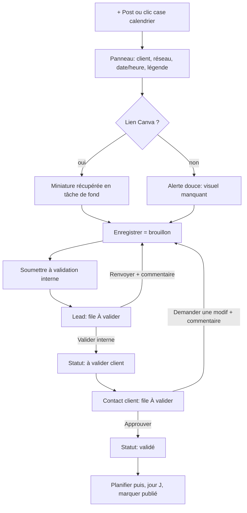
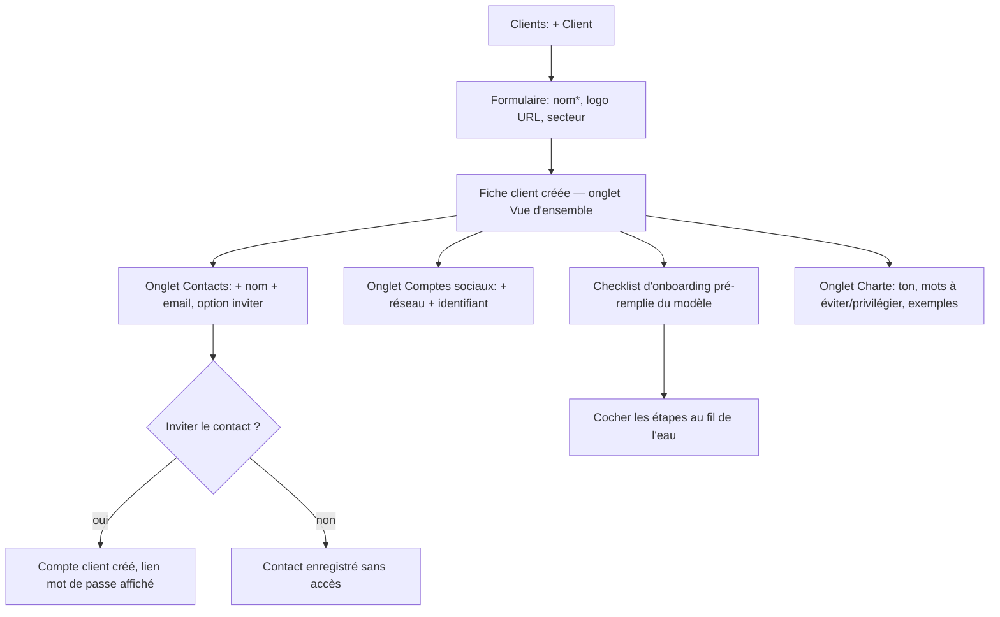
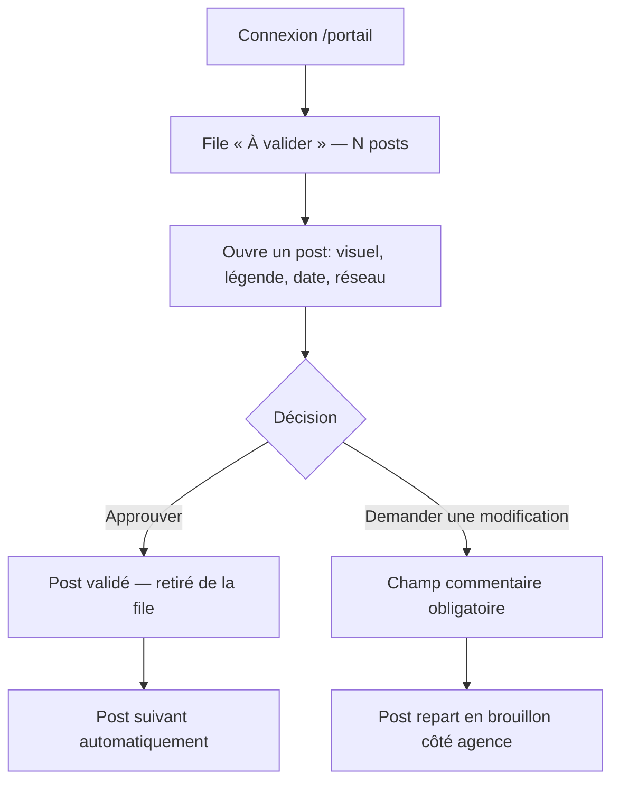

# Outil métier Community Management — UI/UX Specification

Ce document définit les objectifs d'expérience, l'architecture de l'information, les parcours
utilisateurs et le système visuel de l'interface. Il sert de fondation au développement
frontend (Epic 2 et suivants) et complète `docs/prd.md` / `docs/architecture.md`.

Registre : **produit** (l'interface sert la tâche, pas l'inverse). Références : Linear,
Notion, Height, Stripe Dashboard. L'outil doit disparaître derrière le travail du CM.

---

## 1. Objectifs UX & principes

### 1.1 Personas

- **CM (Community Manager)** — persona principal, usage quotidien intensif. Jongle entre
  5–15 clients, produit 15–30 posts/mois/client. Veut : voir la charge d'un coup d'œil,
  créer un post en < 30 s, ne rien oublier (visuel manquant, deadline, marronnier). Travaille
  sur grand écran, souvent plusieurs heures d'affilée. Tolère la densité, déteste les clics
  inutiles et les rechargements de page.
- **Lead CM / Responsable** — supervise 3–5 CM. Vit dans la file « À valider » et la liste
  clients. Veut : repérer les clients à risque (trou de planning, validation en retard),
  valider vite, garder la traçabilité.
- **Admin agence** — usage ponctuel (paramètres, comptes). N'a pas besoin d'un dashboard,
  juste d'écrans de gestion clairs.
- **Contact client** — usage épisodique (1–2×/semaine), souvent pressé, parfois sur mobile.
  Ne connaît pas l'outil. Veut : voir ce qui est proposé, approuver ou demander une
  correction en 2 clics, sans créer de compte compliqué ni apprendre une interface.

### 1.2 Objectifs d'utilisabilité

- **Prise en main CM** : créer un premier post et le soumettre à validation en < 2 min sans
  aide.
- **Efficacité** : re-planifier un post = 1 glisser-déposer ; changer un statut = 1 clic ;
  filtrer par client = 1 clic (filtre mémorisé).
- **Prévention d'erreur** : toute suppression d'un post validé ou d'un client passe par une
  confirmation nommant l'objet ; la corbeille (60 j) est un filet, pas la 1re ligne de
  défense.
- **Mémorabilité** : un CM qui revient après 2 semaines de congés retrouve ses repères sans
  réapprendre (mêmes emplacements, mêmes libellés de statut).
- **Espace client** : un contact approuve une semaine de posts en < 2 min, sur mobile
  compris.

### 1.3 Principes de design

1. **Calendrier d'abord.** L'écran d'accueil interne est le calendrier multi-clients. Le
   détail, la validation, l'organisation se font en panneau latéral ou modale sans quitter
   le contexte.
2. **La densité au service de la tâche.** On assume les tableaux longs et les panneaux
   riches quand le CM en a besoin ; on ne dilue pas l'information « pour aérer ».
3. **Le statut se lit sans effort.** Chaque post porte son statut en texte + pictogramme +
   couleur (jamais la couleur seule). Le vocabulaire de statut est identique partout.
4. **Feedback immédiat.** Toute action a une réponse visible en < 250 ms (optimiste pour le
   drag & drop et les changements de statut, avec rollback si le serveur refuse).
5. **Deux produits, un système.** L'espace agence est dense et outillé ; l'espace client est
   minimal et rassurant. Ils partagent tokens, composants et vocabulaire, pas la densité.
6. **Accessible par défaut.** WCAG AA sur les parcours critiques, navigation clavier
   complète du calendrier, focus visibles, contrastes vérifiés.

### 1.4 Change Log

| Date | Version | Description | Author |
|---|---|---|---|
| 2026-08-30 | v1.0 | Spécification initiale (Sally, UX Expert) — cadre global + focus Epic 2 | UX Expert (BMad) |

---

## 2. Architecture de l'information

### 2.1 Inventaire des écrans

```mermaid
graph TD
  L[/login] --> APP
  L --> POR

  subgraph APP[Espace agence /app]
    CAL["Calendrier /app<br/>(mois · semaine · liste · kanban)"]
    RV["À valider /app/a-valider"]
    CLI["Clients /app/clients"]
    CLID["Fiche client /app/clients/:id<br/>(onglets)"]
    IDE["Idées /app/contenu/idees"]
    TPL["Templates /app/contenu/templates"]
    MAR["Marronniers /app/contenu/marronniers"]
    CAM["Campagnes /app/contenu/campagnes"]
    AL["Alertes /app/alertes"]
    COR["Corbeille /app/corbeille"]
    SET["Paramètres /app/parametres/*"]
  end

  subgraph POR[Espace client /portail]
    PCAL["Calendrier /portail"]
    PRV["À valider /portail/a-valider"]
    PPUB["Publiés /portail/publies"]
    PBR["Briefs /portail/briefs"]
  end

  CAL -.panneau.-> PD["Détail post"]
  RV -.panneau.-> PD
  CLI --> CLID
  PCAL -.panneau.-> PPD["Détail post (vue client)"]
```

### 2.2 Navigation

**Barre supérieure (espace agence)** — persistante, hauteur ~52 px :
`Logo · Calendrier · À valider (badge) · Clients · Contenu ▾ · Alertes (badge) · | · [recherche] · avatar/rôle · ⚙`.
« Contenu ▾ » est un menu (Idées, Templates, Marronniers, Campagnes). « ⚙ » ouvre les
Paramètres (Admin voit tout ; Lead voit les seuils d'alertes ; CM n'y a pas accès).

**Barre supérieure (espace client)** — réduite : `Logo du client · Calendrier · À valider (badge) · Publiés · Briefs · | · avatar · Déconnexion`.

**Fil d'Ariane** : uniquement dans la fiche client (`Clients / Nom du client / Onglet`) et
les Paramètres. Ailleurs, la barre supérieure suffit.

**Barre de filtres** (calendrier, listes) : bandeau sous la barre supérieure, sticky —
`Client(s) ▾ · Statut ▾ · Réseau ▾ · Période · Tag(s) ▾ · [recherche] · Réinitialiser`.
État mémorisé par utilisateur et reflété dans l'URL.

---

## 3. Parcours utilisateurs

### 3.1 Créer et faire valider un post (CM → Lead → Client)

**Objectif :** publier un contenu conforme, validé en interne puis par le client.
**Points d'entrée :** bouton « + Post » (barre sup.), clic sur une case vide du calendrier,
« Transformer en post » depuis une idée / un marronnier / un brief client.
**Critère de succès :** le post atteint le statut « Validé » avec traçabilité complète.



**Cas limites & erreurs :**
- Le client répond alors que le CM a re-modifié : la transition serveur refuse si le statut
  a changé → toast « Ce post a été modifié entre-temps, rechargez ».
- Refus sans commentaire : bloqué côté formulaire ET côté serveur.
- Perte de connexion pendant le drag & drop : rollback visuel + toast.
- Post soumis sans légende : autorisé (brouillon), mais la soumission à validation exige une
  légende non vide.

### 3.2 Créer un client et l'outiller (Epic 2)

**Objectif :** disposer d'une fiche client complète avant de produire du contenu.
**Point d'entrée :** `Clients` → bouton « + Client » (Lead/Admin uniquement).
**Critère de succès :** fiche créée, comptes sociaux + au moins un contact + charte
renseignés, checklist d'onboarding visible.



**Cas limites & erreurs :**
- Nom de client en doublon : autorisé (deux entités distinctes possibles) mais avertissement
  inline « Un client porte déjà ce nom ».
- Suppression d'un compte social référencé par des posts : bloquée, message expliquant
  pourquoi, proposition d'archiver le client à la place.
- Email de contact déjà rattaché à un autre client : le même email peut être contact de
  plusieurs clients ; on rattache le compte auth existant.
- Archiver un client avec des posts « à valider client » en cours : confirmation nommant le
  nombre de posts concernés.

### 3.3 Le client valide ses posts

**Objectif :** répondre à l'agence sans friction.
**Point d'entrée :** lien vers `/portail` (le contact connaît juste l'URL + ses identifiants).
**Critère de succès :** chaque post « à valider client » reçoit une réponse (approuvé /
modif demandée).



**Cas limites :**
- File vide : état « Tout est à jour, rien à valider pour le moment ».
- Mobile : le visuel Canva s'affiche en pleine largeur, boutons Approuver / Demander une
  modification fixés en bas de l'écran.
- Le contact rouvre un post déjà approuvé : lecture seule, badge « Approuvé le … par vous ».

---

## 4. Wireframes & maquettes des écrans clés

Pas d'outil de maquette externe : les layouts sont décrits ici et implémentés directement en
React + Tailwind, écran par écran, avec la skill de design (`impeccable`) en appui.

### 4.1 Calendrier multi-clients (`/app`) — écran d'accueil interne

**Objectif :** visualiser et manipuler toute la production planifiée.

**Éléments clés :**
- Barre de filtres sticky (§2.2). Sélecteur de vue à droite : `Mois · Semaine · Liste · Kanban`.
- **Vue mois** : grille 7×5/6. Chaque jour = colonne empilant des pastilles de post
  (`HH:MM · ⬤réseau · Client`), couleur de la bordure gauche interdite → la couleur est un
  point/à-plat de fond léger teinté du statut, l'icône réseau et le libellé client portent
  l'info. Débordement d'un jour → « +3 » qui ouvre le jour en liste.
- Colonne « non planifiés » optionnelle à gauche (posts sans date, glissables vers le
  calendrier).
- Marronniers du/des clients filtrés en surimpression discrète (ligne pointillée en haut de
  la case jour), activables via un toggle dans la barre de filtres.
- FAB / bouton « + Post » en haut à droite de la zone calendrier.

**Interactions :**
- Clic sur une case vide → panneau de création pré-daté.
- Clic sur un post → panneau de détail (§4.3).
- Glisser un post → change `scheduled_at` (optimiste, rollback si refus ; interdit si pas le
  droit d'éditer ce post → curseur `not-allowed` + tooltip).
- Navigation clavier : flèches pour se déplacer de jour en jour, `Entrée` ouvre le post
  focalisé, `n` crée un post sur le jour focalisé.
- La zone calendrier prend toute la largeur (pas de `max-w` centré — écran large privilégié).

**États :** chargement = skeleton de grille (pas de spinner central) ; aucun post sur la
période = illustration légère + « Aucun post planifié. Créez-en un ou ajustez les filtres. ».

### 4.2 Fiche client (`/app/clients/:id`) — écran phare de l'Epic 2

**Objectif :** tout ce qu'un CM/Lead doit savoir et gérer sur un client.

**Structure :** en-tête + onglets.

```
┌───────────────────────────────────────────────────────────────────────┐
│ Clients / Studio Lumen                                    [Archiver ▾] │
│ ┌──┐  Studio Lumen                        Onboarding 4/7  ·  Actif     │
│ │LO│  Décoration · design d'intérieur                                  │
│ └──┘                                                                    │
├───────────────────────────────────────────────────────────────────────┤
│  Vue d'ensemble │ Comptes sociaux │ Contacts │ Charte │ Onboarding │ Activité │
├───────────────────────────────────────────────────────────────────────┤
│  (contenu de l'onglet actif)                                           │
└───────────────────────────────────────────────────────────────────────┘
```

**Onglet Vue d'ensemble :**
- Cartes d'indicateurs sobres (pas le template « hero-metric ») : « À valider en interne :
  3 », « En attente du client : 1 », « Posts planifiés (30 j) : 12 », « Dernière activité :
  il y a 2 j ». Chaque indicateur est cliquable → calendrier/file filtrés sur ce client.
- Raccourcis : « + Post pour ce client », « Voir le calendrier de ce client », « Ouvrir la
  charte ».
- Résumé : réseaux rattachés (chips), nombre de contacts, secteur.

**Onglet Comptes sociaux :** tableau `Réseau · Identifiant · (actions)`. Bouton « + Compte »
ouvre un formulaire inline (pas de modale) : réseau (select), identifiant. Suppression avec
garde si référencé par des posts.

**Onglet Contacts :** liste `Nom · Email · Accès · Statut · (actions)`. « + Contact »
inline. Sur chaque contact : « Inviter » (crée le compte, affiche le lien mot de passe),
« Désactiver ». Un contact désactivé garde son historique de validations.

**Onglet Charte :** formulaire en sections dépliables — Ton de voix, Mots à éviter, Mots à
privilégier, Exemples de bons posts, Guidelines visuelles. Édition inline avec sauvegarde
explicite par section (bouton « Enregistrer » par section, état « Enregistré » transitoire).
Rendu Markdown léger en lecture.

**Onglet Onboarding :** checklist ordonnée. Chaque item : case + libellé + (qui/quand si
coché). Réordonner par glisser (poignée). « + Étape » en bas. L'avancement `4/7` se
répercute dans l'en-tête et la liste clients.

**Onglet Activité :** journal chronologique inversé (créations, validations, refus,
publications, suppressions/restaurations) filtrable par type et période. Lecture seule.
Visible Lead/Admin, et CM sur ses clients.

**En-tête, menu « Archiver ▾ » :** Archiver (confirmation nommant les posts en cours) /
Supprimer (corbeille, Lead/Admin, double confirmation) ; sur un client archivé : Réactiver.

**Droits :** CM = lecture seule sur ses clients (peut éditer la charte de ses clients),
boutons d'écriture masqués/désactivés avec tooltip. Lead/Admin = édition complète.

### 4.3 Panneau de détail d'un post

**Objectif :** travailler un post sans quitter le calendrier / la file.

Panneau latéral droit, largeur ~480 px (plein écran < 768 px), avec :
- En-tête : client + réseau + statut (chip texte+icône) + menu `⋯` (Dupliquer, Mettre en
  corbeille, Historique).
- Miniature Canva (ou zone « Ajouter un lien Canva » / « Aperçu indisponible — coller une
  miniature »).
- Champs : date/heure (Europe/Paris), légende (textarea auto-grow, compteur indicatif selon
  réseau), rédacteur, campagne, tags.
- Barre d'actions de statut contextuelle : n'affiche que les transitions permises
  (`Soumettre à validation` / `Valider en interne` / `Renvoyer` / …), le bouton principal
  en `primary`, les retours en arrière en `ghost`.
- Fil de commentaires en bas : bascule `Interne` / `Visible client` à la saisie ; chaque
  commentaire éditable/supprimable par son auteur.
- Onglet/section « Historique » : liste horodatée qui/quoi/quand.

### 4.4 Liste des clients (`/app/clients`) — Epic 2, Story 2.6

Tableau pleine largeur, une ligne par client actif (toggle « inclure archivés ») :

`Logo + Nom · Secteur · À valider interne · En attente client · Onboarding (x/y) · Dernière activité · →`

- Tri par n'importe quelle colonne (défaut : « En attente client » décroissant, pour
  remonter les clients qui bloquent).
- Recherche par nom.
- Ligne cliquable → fiche client. Les compteurs « à valider » sont cliquables → file filtrée.
- Skeleton de lignes au chargement. État vide : « Aucun client. Créez le premier. » +
  bouton.

### 4.5 File « À valider » (`/app/a-valider`)

Deux onglets : `À valider en interne (N)` · `En attente du client (M)`. Chaque ligne :
`Client · Réseau · Date prévue · Extrait de légende · Ancienneté dans le statut · Rédacteur`.
Tri par ancienneté décroissante. Actions rapides par ligne (ouvrir, valider en interne,
relancer le client — marque l'alerte, pas d'email v1). Filtre client.

### 4.6 Espace client — Calendrier & détail (`/portail`)

- Calendrier mensuel + bascule Liste, en lecture. Pastilles avec statut lisible.
- File « À valider » mise en avant (compteur dans la nav + encart en haut du calendrier tant
  qu'il reste des posts à traiter).
- Détail post (vue client) : visuel plein cadre, légende, date, réseau, commentaires
  `visible client` seulement. Deux boutons : `Approuver` (primary) et `Demander une
  modification` (outline, ouvre le champ commentaire). Sur mobile, ces boutons sont
  `position: sticky` en bas.
- « Publiés » : liste chronologique avec visuel + légende + date. « Briefs » : liste des
  demandes + bouton « Nouvelle demande ».

---

## 5. Système de composants / Design system

### 5.1 Approche

Base **shadcn/ui (Radix)** déjà en place (`src/components/ui/`). On étend cette base ; on ne
réinvente aucun affordance standard (pas de scrollbar custom, pas de select maison, pas de
modale maison). Tokens centralisés dans `src/styles/globals.css`. Les composants composés
métier vivent dans `src/components/` (ex. `PostCard`, `StatusBadge`, `NetworkIcon`,
`ClientAvatar`, `FiltersBar`, `CommentThread`, `EmptyState`, `DataTable`).

### 5.2 Composants fondamentaux et leurs états

Chaque composant interactif expose : **default · hover · focus-visible · active · disabled ·
loading · error** (et `selected` quand pertinent). On ne livre pas un composant avec la
moitié de ces états.

- **Button** — variants : `primary` (action principale unique par zone), `outline`
  (secondaire), `ghost` (tertiaire / retour en arrière), `destructive` (corbeille /
  suppression). Tailles `sm · default · lg · icon`. `loading` = spinner + libellé
  (« Enregistrement… »), largeur stable.
- **StatusBadge** — un par statut (`Brouillon · À valider interne · À valider client ·
  Validé · Planifié · Publié`). Toujours texte + pictogramme + fond teinté ; jamais la
  couleur seule. Même composant côté agence et côté client.
- **NetworkIcon** — jeu d'icônes monochromes cohérentes (Instagram, LinkedIn, Facebook,
  TikTok, X, YouTube, Pinterest, Threads). Style uniforme (trait, pas de logos couleur
  bruités dans les listes denses ; couleur de marque réservée aux gros affichages).
- **Input / Textarea / Select (natif stylé) / Checkbox / Radio / Switch** — vocabulaire de
  contrôle unique partout. `aria-invalid` + message `role="alert"` sous le champ.
- **DataTable** — en-têtes triables, lignes cliquables, sélection multiple (cases +
  « tout sélectionner sur le résultat filtré »), barre d'actions en masse flottante en bas
  quand une sélection existe. Skeleton de lignes au chargement.
- **SidePanel** — panneau latéral droit (Radix Dialog en variante non-modale sur desktop,
  plein écran < 768 px). Fermeture Échap / clic extérieur / bouton.
- **Dialog** (modale) — réservé aux confirmations destructives et aux formulaires courts qui
  n'ont pas de place inline (création client, assignations). « Modal as last resort ».
- **Toast** — feedback transitoire (succès, erreur réseau, rollback). Position bas-droite.
  Non bloquant.
- **EmptyState** — illustration légère + phrase qui apprend l'interface + action. Jamais
  « Rien ici ».
- **FiltersBar** — chips de filtre, bouton « Réinitialiser » visible dès qu'un filtre est
  actif, état persisté + URL.
- **Calendar** (FullCalendar habillé) — pastille de post, case jour, surimpression
  marronnier, drag & drop.
- **CommentThread** — bascule visibilité à la saisie, édition/suppression inline, ancre
  temporelle.
- **Confirmation destructive** — nomme toujours l'objet (« Mettre à la corbeille le post du
  12 mars pour Studio Lumen ? »).

---

## 6. Charte & style

### 6.1 Identité visuelle

Pas de charte imposée. Direction : **sobre, professionnelle, neutre**, qui laisse respirer
les logos et couleurs des clients (affichés sur les cartes de post et les fiches). L'accent
de l'outil est unique (indigo, déjà dans le code) et réservé aux actions primaires, à la
sélection courante et aux indicateurs d'état — jamais décoratif. Stratégie couleur :
**Restrained** (défaut produit).

### 6.2 Palette (OKLCH — à porter dans `globals.css`)

Migration recommandée des tokens HSL actuels vers OKLCH, en conservant l'indigo comme
primaire (préservation d'identité).

| Rôle | Clair | Sombre (v2, préparer les tokens) | Usage |
|---|---|---|---|
| `--bg` | `oklch(0.99 0.002 260)` | `oklch(0.17 0.01 260)` | Fond de contenu |
| `--surface` | `oklch(1 0 0)` | `oklch(0.21 0.012 260)` | Cartes, panneaux, lignes de tableau |
| `--surface-2` | `oklch(0.975 0.004 260)` | `oklch(0.24 0.012 260)` | Barres d'outils, en-têtes de tableau, sidebars (2e couche neutre) |
| `--border` | `oklch(0.92 0.004 260)` | `oklch(0.30 0.012 260)` | Séparateurs, contours d'input |
| `--ink` | `oklch(0.28 0.02 260)` | `oklch(0.96 0.005 260)` | Texte principal (contraste ≥ 7:1 sur `--bg`) |
| `--ink-muted` | `oklch(0.50 0.02 260)` | `oklch(0.72 0.01 260)` | Texte secondaire (contraste ≥ 4.5:1 — **pas plus clair**) |
| `--primary` | `oklch(0.55 0.19 268)` | `oklch(0.68 0.17 268)` | Actions primaires, sélection, focus |
| `--primary-ink` | `oklch(0.99 0 0)` | `oklch(0.17 0.01 260)` | Texte sur `--primary` |
| `--success` | `oklch(0.62 0.15 150)` | `oklch(0.72 0.14 150)` | Validé, confirmations |
| `--warning` | `oklch(0.75 0.14 75)` | `oklch(0.80 0.13 75)` | Deadline proche, visuel manquant |
| `--danger` | `oklch(0.58 0.20 27)` | `oklch(0.68 0.19 27)` | Suppression, refus, alerte urgente |
| `--info` | `oklch(0.62 0.12 240)` | `oklch(0.72 0.11 240)` | Informations neutres |

**Statuts de post** (fond teinté très léger + texte foncé de la même teinte, pas de gris sur
couleur) :
`Brouillon` → neutre (`--surface-2` / `--ink-muted`) ·
`À valider interne` → info ·
`À valider client` → warning ·
`Validé` → success ·
`Planifié` → primary (teinte douce) ·
`Publié` → neutre foncé / « terminé ».

Contrastes : **tout texte de corps ≥ 4.5:1**, grands textes ≥ 3:1, placeholders ≥ 4.5:1. Le
gris clair « pour l'élégance » est proscrit.

### 6.3 Typographie

- **Une seule famille** : `Inter` (variable) avec repli `system-ui, -apple-system, "Segoe UI", Roboto, sans-serif`. Chargée en self-host (pas de CDN). Mono (`ui-monospace, "SF Mono", Menlo`) pour les liens Canva, ids, extraits techniques.
- **Échelle rem fixe** (pas de `clamp` en UI produit), ratio ~1.2 :

| Élément | Taille | Poids | Interligne |
|---|---|---|---|
| Titre de page (h1) | 20 px | 600 | 1.3 |
| Section (h2) | 16 px | 600 | 1.4 |
| Sous-section (h3) | 14 px | 600 | 1.4 |
| Corps | 14 px | 400 | 1.5 |
| Corps dense (tableaux) | 13 px | 400 | 1.45 |
| Légende / méta | 12 px | 400–500 | 1.4 |

- Prose (charte, aide) plafonnée à 70ch. Pas d'ALL CAPS en corps ; réservé aux badges et
  libellés ≤ 3 mots. Pas d'eyebrow tracké au-dessus de chaque section.

### 6.4 Iconographie

`lucide-react` (déjà l'esprit shadcn), trait 1.5–2 px, taille 16 px en UI dense, 20 px en
en-têtes. Style uniforme, jamais mélangé avec des logos couleur en contexte dense.

### 6.5 Espacement & layout

- Échelle d'espacement Tailwind par défaut (multiples de 4 px). Rythme vertical varié
  (sections : 24–32 px ; à l'intérieur d'un panneau : 12–16 px).
- Largeur : les vues calendrier / listes / tableaux prennent **toute la largeur** du
  viewport (padding latéral 24–32 px). Pas de conteneur centré étroit. La prose (charte,
  aide) est le seul contenu borné (~70ch).
- Rayons : `--radius` 8 px (cartes, panneaux), 6 px (inputs, boutons), 4 px (chips/badges).
- Ombres : discrètes, une seule élévation pour les panneaux/menus. Pas de glassmorphism.
- Z-index sémantique : `dropdown(1000) → sticky(1100) → panel(1200) → modal-backdrop(1300) → modal(1400) → toast(1500) → tooltip(1600)`.

---

## 7. Accessibilité

**Cible : WCAG 2.1 AA** sur les parcours critiques (connexion, navigation calendrier,
ouverture/édition/validation d'un post, commentaire, approbation côté client).

**Visuel :**
- Contraste texte de corps ≥ 4.5:1, grand texte ≥ 3:1, composants/état ≥ 3:1. Vérifié à
  chaque écran.
- Focus visible sur **tous** les éléments interactifs (anneau 2 px `--primary`, offset 2 px).
- L'information n'est jamais portée par la seule couleur (statut = texte + icône).
- Zoom 200 % sans perte de contenu ni scroll horizontal du corps de page.

**Interaction :**
- Navigation clavier complète du calendrier (déplacement jour/jour, ouverture, création),
  des tableaux (tri, sélection), des panneaux (piège de focus dans les modales, Échap pour
  fermer).
- Cibles tactiles ≥ 44×44 px dans l'espace client (usage mobile).
- Ordre de tabulation logique ; `aria-live="polite"` pour les compteurs de badge et les
  toasts de succès, `assertive` pour les erreurs bloquantes.

**Contenu :**
- Tout champ a un `<label>` associé (`htmlFor`/`id`). Erreurs liées au champ via
  `aria-describedby`, annoncées `role="alert"`.
- Hiérarchie de titres cohérente (un seul h1 par écran).
- Icônes décoratives `aria-hidden` ; icônes porteuses de sens ont un `aria-label`.
- Textes centralisés (`i18next`) — FR uniquement en v1, mais prêts à traduire.

**Tests :** `eslint-plugin-jsx-a11y` sans erreur (déjà en place) ; check `axe` sur les pages
clés dans les tests E2E ; passe manuelle clavier + lecteur d'écran sur les 5 parcours
critiques (Story 9.5).

---

## 8. Stratégie responsive

Le responsive est **structurel** (colonnes, panneaux, tableaux), pas de la typographie
fluide.

| Breakpoint | Largeur | Cibles | Comportement |
|---|---|---|---|
| Mobile | < 640 px | Téléphone (surtout espace client) | Espace agence : calendrier en vue Liste forcée, filtres dans un tiroir, panneau détail plein écran. Espace client : pleinement supporté, boutons d'action sticky en bas. |
| Tablet | 640–1024 px | iPad | Agence utilisable en dépannage : calendrier semaine/liste, barre sup. condensée. Client : confortable. |
| Desktop | 1024–1536 px | Portable agence | Layout de référence. Calendrier mois + panneau latéral côte à côte. |
| Wide | > 1536 px | Écran 27–32" (cas réel de l'équipe) | Le calendrier exploite toute la largeur, plus de jours/semaines visibles ; pas de `max-w` qui laisse des marges vides. Panneau détail en overlay, pas en pousse-contenu. |

**Adaptations :**
- Navigation : barre supérieure → menu « hamburger » < 768 px (agence) ; l'espace client
  garde une nav horizontale réduite (4 entrées).
- Priorité de contenu mobile (client) : file « À valider » d'abord, puis calendrier, puis
  publiés/briefs.
- Tableaux : < 1024 px, les colonnes secondaires (secteur, rédacteur) passent en ligne
  secondaire sous le nom, ou se masquent derrière un « ⋯ ».

---

## 9. Animation & micro-interactions

**Principes :** la motion **traduit un état**, jamais décorative. 150–250 ms sur la plupart
des transitions. Courbes `ease-out` (quart/quint), pas de bounce. Aucune séquence
orchestrée au chargement de page. `@media (prefers-reduced-motion: reduce)` → transitions
instantanées ou simple fondu.

**Animations clés :**
- **Ouverture du panneau détail :** glissement depuis la droite + fondu, 200 ms, ease-out. Reduced-motion : fondu 120 ms.
- **Changement de statut :** le `StatusBadge` fait un cross-fade vers la nouvelle couleur/libellé, 180 ms.
- **Drag & drop calendrier :** la pastille suit le curseur (transform, pas de layout), la case cible s'éclaircit ; au drop, transition douce vers la position finale, 200 ms ; en cas de rollback, retour animé à l'origine + shake léger 1 fois.
- **Case d'onboarding cochée :** coche qui se dessine, 160 ms ; la barre d'avancement `x/y` s'ajuste, 200 ms.
- **Toast :** entrée par le bas (translate + fade) 180 ms, sortie en fondu.
- **Skeletons :** pulsation lente (1.5 s) pendant le chargement des listes et du calendrier.
- **Badge compteur :** incrément avec un léger « pop » (scale 1 → 1.15 → 1), 150 ms.
- **Liste de résultats filtrés :** stagger léger (20 ms/ligne, plafonné à ~8 lignes) à l'application d'un filtre — jamais au chargement initial.

---

## 10. Performance (impact UX)

- **Chargement de vue** < 1,5 s en conditions normales ; interaction (clic → réponse
  visible) < 100 ms (optimiste) ; animations 60 fps.
- **Stratégies :**
  - Routes en `React.lazy` ; FullCalendar chargé en lazy sur la vue calendrier uniquement
    (le sortir du bundle initial ramène l'entrée sous ~300 kB gzip — cible NFR).
  - Listes longues (posts, kanban) virtualisées (`@tanstack/react-virtual`).
  - Skeletons plutôt que spinners centraux ; pas de blocage plein écran hors résolution de
    session.
  - Miniatures Canva : `loading="lazy"`, dimensions réservées (pas de CLS), récupération
    asynchrone non bloquante.
  - Filtres : requêtes indexées côté Postgres (`(client_id, scheduled_at)`, `tsvector`),
    `staleTime` 30–60 s côté TanStack Query, invalidation ciblée après mutation.

---

## 11. Prochaines étapes

### 11.1 Actions immédiates

1. Porter la palette OKLCH et l'échelle typo dans `src/styles/globals.css` + `tailwind.config.ts` (petite story technique, ou intégré à la 1re story d'Epic 2).
2. Self-host Inter (variable) ; retirer toute dépendance de police externe.
3. Créer les composants transverses manquants avant les écrans : `StatusBadge`, `NetworkIcon`, `EmptyState`, `DataTable`, `SidePanel`, `FiltersBar`.
4. Démarrer l'Epic 2 par la Story 2.1 (fiche client + archivage) en implémentant la coquille « en-tête + onglets » de §4.2.
5. Créer `PRODUCT.md` / `DESIGN.md` (skill `impeccable init`) pour figer ce système côté design.

### 11.2 Checklist de handoff

- [x] Parcours utilisateurs critiques documentés (§3)
- [x] Inventaire des composants (§5)
- [x] Exigences d'accessibilité définies (§7)
- [x] Stratégie responsive claire (§8)
- [x] Éléments de charte intégrés (§6) — palette, typo, espacement, motion
- [x] Objectifs de performance établis (§10)
- [ ] Revue avec l'équipe (CM + Lead) — à planifier
- [ ] Validation des libellés de statut FR avec l'équipe

---

## 12. Handoff vers l'architecte

L'architecture (`docs/architecture.md`) est déjà rédigée et compatible avec cette spec.
Points à répercuter si besoin :
- Section « Frontend Architecture » : ajouter `StatusBadge`, `NetworkIcon`, `SidePanel`,
  `DataTable`, `FiltersBar`, `EmptyState` à l'inventaire des composants partagés.
- Section « Tech Stack » : ajouter `lucide-react` (icônes) et `@tanstack/react-virtual`
  (virtualisation) ; acter Inter self-host.
- Confirmer le lazy-loading de FullCalendar pour tenir la cible de bundle (NFR).
